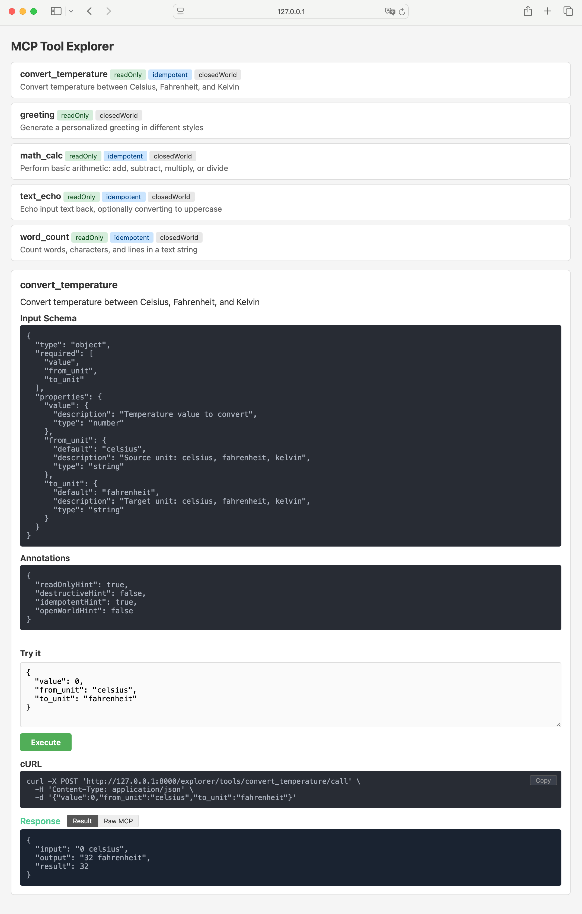

# Examples Specification: apcore-mcp Cross-Language Standard

| Field   | Value                          |
|---------|--------------------------------|
| Version | 1.1                            |
| Date    | 2026-02-25                     |
| Status  | Active                         |
| Applies | All apcore-mcp-{lang} projects |

---

## 1. Purpose

Every `apcore-mcp-{lang}` implementation MUST ship an `examples/` directory with runnable demo modules. These examples serve as:

1. **Quick start** — Users can launch the Explorer UI and interact with tools immediately.
2. **Integration test** — Verifies the full stack (Registry → Executor → MCP Server → Explorer).
3. **Reference patterns** — Demonstrates both module definition styles supported by the language.

## 2. Required Modules

Each implementation MUST provide exactly **5 demo modules**:

| Module ID | Category | Description | Annotations |
|-----------|----------|-------------|-------------|
| `text_echo` | Class-based | Echo text back, optionally uppercase | readonly, idempotent, closedWorld |
| `math_calc` | Class-based | Basic arithmetic (add, sub, mul, div) | readonly, idempotent, closedWorld |
| `greeting` | Class-based | Personalized greeting in 3 styles (friendly, formal, pirate) | readonly, closedWorld |
| `convert_temperature` | Zero-code | Celsius / Fahrenheit / Kelvin conversion | readonly, idempotent, closedWorld |
| `word_count` | Zero-code | Count words, characters, and lines | readonly, idempotent, closedWorld |

### 2.1 Class-Based Modules

Must use the language's native apcore module format (auto-discovered by Registry):

| Language | Format |
|----------|--------|
| Python | Class with `input_schema` (Pydantic), `output_schema`, `description`, `execute()` |
| TypeScript | Default export object with `inputSchema` (TypeBox), `outputSchema`, `description`, `execute()` |

### 2.2 Zero-Code Modules

Must wrap plain business functions **without modifying** the original source file (`myapp.{ext}`):

| Language | Mechanism |
|----------|-----------|
| Python | `binding.yaml` with `auto_schema: true` + `BindingLoader` |
| TypeScript | `module()` factory from apcore-js with explicit TypeBox schemas |

The key principle: `myapp.{ext}` has **zero apcore imports** — it is pure business logic.

## 3. Module Schemas

### 3.1 text_echo

**Input:**
| Field | Type | Default | Description |
|-------|------|---------|-------------|
| `text` | string | (required) | Text to echo back |
| `uppercase` | boolean | `false` | Convert to uppercase |

**Output:**
| Field | Type | Description |
|-------|------|-------------|
| `echoed` | string | The echoed text |
| `length` | integer | Character count |

### 3.2 math_calc

**Input:**
| Field | Type | Default | Description |
|-------|------|---------|-------------|
| `a` | number | (required) | First operand |
| `b` | number | (required) | Second operand |
| `op` | string | `"add"` | Operation: add, sub, mul, div |

**Output:**
| Field | Type | Description |
|-------|------|-------------|
| `result` | number | Calculation result |
| `expression` | string | Human-readable expression (e.g., `"10 + 3 = 13"`) |

**Error cases:** Unknown operation, division by zero.

### 3.3 greeting

**Input:**
| Field | Type | Default | Description |
|-------|------|---------|-------------|
| `name` | string | (required) | Name of the person to greet |
| `style` | string | `"friendly"` | Greeting style: friendly, formal, pirate |

**Output:**
| Field | Type | Description |
|-------|------|-------------|
| `message` | string | The greeting message |
| `timestamp` | string | ISO 8601 timestamp |

**Style templates:**
- `friendly` → `"Hey {name}! Great to see you!"`
- `formal` → `"Good day, {name}. It is a pleasure to make your acquaintance."`
- `pirate` → `"Ahoy, {name}! Welcome aboard, matey!"`

### 3.4 convert_temperature

**Input:**
| Field | Type | Default | Description |
|-------|------|---------|-------------|
| `value` | number | (required) | Temperature value |
| `from_unit` | string | `"celsius"` | Source unit: celsius, fahrenheit, kelvin |
| `to_unit` | string | `"fahrenheit"` | Target unit: celsius, fahrenheit, kelvin |

**Output:**
| Field | Type | Description |
|-------|------|-------------|
| `input` | string | Input value and unit (e.g., `"100 celsius"`) |
| `output` | string | Converted value and unit (e.g., `"212 fahrenheit"`) |
| `result` | number | Numeric result (rounded to 2 decimals) |

### 3.5 word_count

**Input:**
| Field | Type | Default | Description |
|-------|------|---------|-------------|
| `text` | string | (required) | Text to analyze |

**Output:**
| Field | Type | Description |
|-------|------|-------------|
| `words` | integer | Word count |
| `characters` | integer | Character count |
| `lines` | integer | Line count |

## 4. Directory Structure

```
examples/
├── README.md                  # Language-specific quick start
├── run.{ext}                  # Unified launcher (all 5 modules)
├── extensions/                # Class-based modules (auto-discovered)
│   ├── text_echo.{ext}
│   ├── math_calc.{ext}
│   └── greeting.{ext}
└── binding_demo/              # Zero-code wrapping demo
    ├── myapp.{ext}            # Plain business logic (NO apcore imports)
    ├── run.{ext}              # Zero-code-only launcher
    └── extensions/            # (Python only: binding.yaml files)
```

## 5. Launcher Requirements

### 5.1 Unified Launcher (`examples/run.{ext}`)

Must:
1. Discover all 3 class-based modules via `Registry.discover()`
2. Load/wrap all 2 zero-code modules into the same registry
3. Print module counts: class-based, zero-code, total
4. Launch MCP server with `transport=streamable-http`, `host=127.0.0.1`, `port=8000`, `explorer=true`, `allowExecute=true`

### 5.2 Zero-Code Launcher (`examples/binding_demo/run.{ext}`)

Must:
1. Load only the 2 zero-code modules
2. Launch MCP server with the same options

## 6. Explorer `/call` Response Contract

The Explorer `/call` API endpoint MUST return MCP-compliant `CallToolResult` format:

```jsonc
// Success (HTTP 200)
{
  "content": [{"type": "text", "text": "{\"words\":2,...}"}],
  "isError": false,
  "_meta": {"_trace_id": "uuid"}  // optional, only when traceId available
}

// Error (HTTP 500)
{
  "content": [{"type": "text", "text": "error message"}],
  "isError": true
}
```

## 7. Explorer UI Display Contract

After the user clicks **Execute**, the Explorer frontend MUST render three sections in order:

### 7.1 cURL Command

Show the equivalent `curl` command for the request, with a **Copy** button.

```
┌─ cURL ──────────────────────────────────────────────────┐
│ curl -X POST 'http://127.0.0.1:8000/explorer/tools/…'\ │ [Copy]
│   -H 'Content-Type: application/json' \                 │
│   -d '{"text": "hello world"}'                          │
└─────────────────────────────────────────────────────────┘
```

Requirements:
- URL MUST be the full absolute URL (`window.location.origin` + Explorer base + `/tools/{name}/call`).
- Single quotes in the JSON body MUST be shell-escaped (`'\''`).
- Copy button MUST use `navigator.clipboard.writeText()` and show brief "Copied!" feedback.
- cURL section MUST appear for **both** success and error responses.

### 7.2 Response — Tabbed View (success)

On success (`isError: false`), show a tabbed response with two views:

```
Response  [Result ✓] [Raw MCP]
┌─────────────────────────────────────┐
│ {                                   │   ← "Result" tab (default, active)
│   "words": 2,                       │
│   "characters": 11,                 │
│   "lines": 1                        │
│ }                                   │
└─────────────────────────────────────┘
```

| Tab | Content | Purpose |
|-----|---------|---------|
| **Result** (default) | Parsed `content[].text` — JSON-parsed if valid, raw text otherwise. Single-item arrays unwrapped. | Friendly view for end users |
| **Raw MCP** | Full MCP `CallToolResult` JSON (`content`, `isError`, `_meta`) | Protocol debugging for developers |

### 7.3 Response — Error View

On error (`isError: true`), show the error text directly (no tabs):

```
Response — Error
┌─────────────────────────────────────┐
│ Division by zero                    │
└─────────────────────────────────────┘
```

Error text is extracted from `content[].text` blocks joined with newlines.

### 7.4 Implementation Notes

- `defaultFromSchema()` MUST use `!= null` (not `!== undefined`) to skip both `null` and `undefined` defaults, falling through to type-based placeholders.
- All dynamic content MUST be HTML-escaped before insertion to prevent XSS.

## 8. Compliance Checklist

For each new `apcore-mcp-{lang}` implementation:

- [ ] 5 modules present with matching IDs and schemas
- [ ] Class-based modules use language-native apcore format
- [ ] Zero-code modules wrap `myapp.{ext}` without modifying it
- [ ] Unified launcher discovers all 5 and serves on port 8000
- [ ] Explorer UI shows all 5 tools with correct annotations
- [ ] Tool execution returns correct results for all 5 modules
- [ ] `defaultFromSchema()` skips `null` defaults (`!= null` check)
- [ ] `execTool()` shows cURL command with Copy button
- [ ] `execTool()` shows tabbed Result / Raw MCP response on success
- [ ] `execTool()` shows cURL + error text on error

## Appendix: Explorer UI Reference


