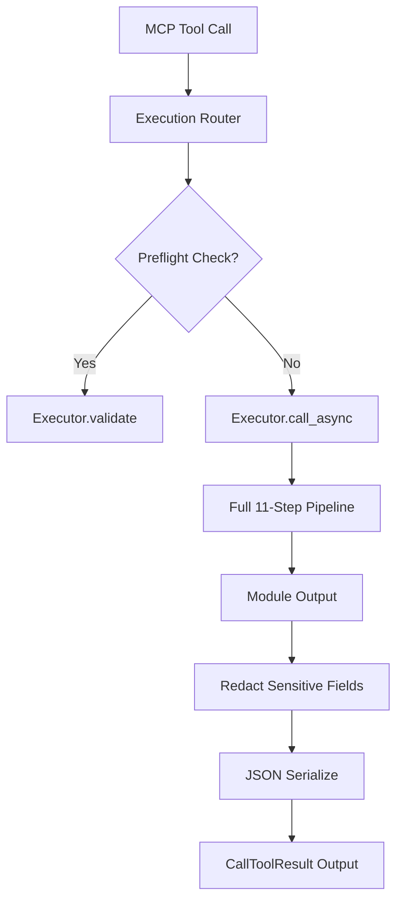

# Execution Router

> Feature spec for code-forge implementation planning.
> Source: extracted from apcore-mcp/docs/tech-design-apcore-mcp.md
> Created: 2026-04-06

## Purpose

The Execution Router is the central dispatcher that receives tool-call requests from the MCP server and routes them through apcore's `Executor` pipeline. It ensures that every tool call from an AI agent is subject to the same rigorous validation, security (ACL), and middleware rules as any other module invocation in the apcore ecosystem.

## Scope

**Included:**
- Routing tool calls by `module_id` with incoming arguments (dict).
- Integration with apcore's `Executor.call_async()` to handle both sync and async modules.
- Serialization of module output (from dicts) into standard JSON strings for MCP `TextContent`.
- Redaction of sensitive fields in tool output before returning to the agent.
- Optional capturing of pipeline traces for observability.
- Pre-execution validation ("Preflight Check") to verify if a tool call would succeed.

**Excluded:**
- Direct module execution (always delegates to `Executor`).
- Protocol-level message handling (handled by the MCP SDK).

## Core Responsibilities

1. **Dispatcher** — Maps the tool name to the appropriate apcore `module_id` and executes it through the full 11-step pipeline.
2. **Output Normalization** — Converts various module output types into a consistent JSON string format using `json.dumps()` with a `default=str` fallback for non-serializable objects.
3. **Data Protection** — Automatically redacts fields marked as sensitive (`x-sensitive: true`) and keys matching `_secret_*` to prevent accidental leak of credentials to AI agents.
4. **Validation Gateway** — Provides a non-destructive preflight validation path (`Executor.validate()`) that checks ACLs and schemas without executing the actual module.

## Interfaces

### Inputs
- **Tool Name** (MCP Client) — The identifier of the tool to be called (maps to `module_id`).
- **Arguments** (MCP Client) — A dictionary of input values conforming to the tool's `input_schema`.

### Outputs
- **CallToolResult** (MCP SDK) — The final result (success with text content or error).
- **PreflightResult** (Internal/Explorer) — A summary of check results (module lookup, ACL, schema validation) without execution.

### Dependencies
- **apcore-python SDK** — Provides the `Executor`, `Context`, and `Registry`.
- **Error Mapper** — Used to transform execution failures into formatted MCP error responses.

## Data Flow



## Key Behaviors

### Full Pipeline Enforcement
The router ensures every call passes through all 11 apcore pipeline steps: context creation, call-chain guard, module lookup, ACL check, approval gate, middleware before, input validation, execution, output validation, middleware after, and final return.

### ExtensionManager Plugin Points
When the server is constructed with an `ExtensionManager` (see `./extension-bridge.md` and `apcore/docs/features/extension-system.md`), the router itself does not register extensions — `ExtensionManager.apply()` runs during factory setup and mutates the underlying `Executor` and `Registry`. Three pipeline steps are the effective observation/mutation sites for extension-driven behavior:

- **Step 2 (module lookup)** — observes the `discoverer` and `module_validator` extension points, wired onto the `Registry` before the router is constructed.
- **Step 5 (middleware before) / Step 10 (middleware after)** — observe user-registered `middleware` extensions layered onto the `Executor`, including the `TracingMiddleware` fed by `span_exporter` extensions. The `acl` and `approval_handler` extensions take effect at Steps 4 and 5 respectively via their dedicated executor slots.

The router's contract with extensions is strictly pass-through: it forwards the current `Context` and arguments into the Executor and never skips pipeline steps, so registered extensions always fire exactly once per tool call.

### Output Redaction
Before the output is sent to the AI agent, the router applies recursive redaction. Any field with `x-sensitive: true` in its schema or any key starting with `_secret_` has its value replaced by `"***REDACTED***"`.

### Async-First Strategy
The router always uses `Executor.call_async()`. This allows the MCP server to remain responsive by offloading synchronous module executions to worker threads via `asyncio.to_thread()` automatically.

## Constraints

- **Thread Safety**: Must handle concurrent tool calls from multiple clients safely.
- **Latency**: The routing layer itself should add minimal overhead (< 5ms) beyond the actual module execution time.
- **Data Integrity**: Must operate on a deep copy of the output if redaction or transformation is required.

## Error Handling

- **Dispatch Failures**: Catches all execution errors (ModuleNotFoundError, ACLDeniedError, etc.) and routes them to the `ErrorMapper` to prevent raw tracebacks from reaching the client.
- **Serialization Failures**: Provides a safe fallback if the module output cannot be converted to JSON.

## Version Hint Negotiation

The Execution Router resolves an optional `version_hint` (semver range) for every tool call and forwards it to `Executor.call(..., version_hint=...)` so that apcore can pin module version resolution. The hint is cross-language and travels on the wire as MCP request metadata.

### Wire Contract
The MCP client carries the hint at `params._meta.apcore.version` (string). Example:
```json
{
  "method": "tools/call",
  "params": {
    "name": "my-module",
    "arguments": { "...": "..." },
    "_meta": { "apcore": { "version": ">=1.2.0" } }
  }
}
```

### Value Format
- Semver range string (e.g., `">=1.0.0"`, `"1.2.x"`, `"^2.0"`).
- Maximum length: 64 characters.
- Allowed charset: `[A-Za-z0-9.\-+_~^>=<* ]`.

### Precedence Order
When multiple sources supply a hint, the router resolves in this order (first match wins):
1. Explicit `extras.version_hint` / `extra.versionHint` — SDK caller-supplied (highest priority).
2. MCP request `_meta.apcore.version` — client-supplied.
3. Module descriptor default `metadata.version_hint` / `metadata.versionHint` (lowest).
4. `None` — no pinning; apcore resolves to the latest matching version.

### Validation
- Values exceeding the length cap or containing characters outside the allowed charset are silently dropped (treated as absent), with a `debug`-level log line for diagnosis.
- Malformed semver ranges are passed through to apcore unchanged; apcore rejects them with the standard `invalid_version_range` error, which is surfaced via the Error Mapper.
- The `_meta` dict is untrusted input from the MCP client; SDKs MUST bound-check and charset-validate before forwarding to the Executor (security note).

### Trace-Mode Caveat
When the request carries `_meta.trace == true`, `version_hint` may be unavailable in some SDKs pending apcore 0.19's `call_with_trace` signature extension. This is a known gap tracked by the Rust SDK TODO (`src/server/router.rs`, see `TODO(apcore>=0.19)`); implementations that cannot forward the hint through the trace path MUST still honor it on the non-trace path.

### Implementation References
- Python: `src/apcore_mcp/server/router.py` (version_hint extraction around the `_meta.apcore.version` branch).
- TypeScript: `src/server/router.ts` (`versionHint` resolution at the extras/`_meta.apcore.version`/descriptor cascade).
- Rust: `src/server/router.rs` (`handle_call` — `version_hint` extraction and `TODO(apcore>=0.19)` streaming-trace gap).

## Cancellation Handling

> **Status (v0.14.0):** the bidirectional `ExecutionRouter.cancel(call_id, reason)` API previously sketched in this section is **not yet implemented**. Today, `notifications/cancelled` handling lives at the transport layer in Rust only; Python and TypeScript do not parse or forward the notification. This section now describes **actual** behavior at v0.14.0; the more ambitious design previously documented is preserved in the Roadmap subsection below for tracking.

### What works today (v0.14.0)

- **Process-level cancellation (stdio):** When the parent MCP client closes the stdio pipe, the transport manager exits the read loop and the server shuts down. In-flight tool calls are abandoned (no cooperative drain). All three SDKs (Python, TypeScript, Rust) behave this way.
- **Async-task cancellation (Rust only):** Rust's `TransportManager` accepts a `cancel_handler` callback (`set_cancel_handler` / `notify_cancel`). At server build time, `apcore_mcp::APCoreMCP` wires this callback to `AsyncTaskBridge::cancel_session_tasks(session_key)` and `AsyncTaskBridge::cancel(task_id)`. When an MCP `notifications/cancelled` message is received, async-task-bridge tasks bound to that session are cooperatively cancelled. **Synchronous** tool calls (those routed through `ExecutionRouter::handle_call`) are NOT cancelled — there is no `CancelToken` map and no `ContextVar` propagation. Python and TypeScript SDKs do not implement this at all.
- **Error mapping for explicit `ExecutionCancelledError`:** if a module itself raises `ExecutionCancelledError` (e.g., on a timeout), the router catches it and forwards to the Error Mapper, which emits MCP error code `EXECUTION_CANCELLED`. This is downstream-only; nothing in the router *initiates* cancellation in response to MCP `notifications/cancelled`.

### What does NOT work today

- `ExecutionRouter.cancel(call_id, reason)` — the method does not exist in any of the three SDKs (Python, TypeScript, Rust).
- A per-server `Dict[call_id, CancelToken]` map — there is no such map in any SDK.
- `ContextVar` propagation of an active `CancelToken` across `asyncio.to_thread()` boundaries — not implemented.
- Cancellation of synchronous tool calls via MCP `notifications/cancelled` — not supported in any transport in any SDK.
- A "tombstone" race-handling pattern for cancel-before-start — not implemented (and unnecessary without the token map).

If your client code relied on the previously-documented behavior, you will need to either (a) wait for the planned 0.15.0 implementation tracked below, or (b) implement client-side timeouts as the only reliable cancellation primitive at v0.14.0.

### Roadmap (planned for 0.15.0)

The following design is preserved verbatim from earlier drafts as the implementation target:

- A per-server `Dict[call_id, CancelToken]` (guarded by a lock). On tool-call entry, the router generates/extracts the MCP `call_id`, creates a fresh `CancelToken`, inserts into the map, and attaches it to the `Context` via `Context.create(cancel_token=token)`. On completion the entry is removed in `finally`.
- An `ExecutionRouter.cancel(call_id, reason)` method that:
  1. Looks up the `CancelToken` for `call_id`.
  2. Calls `token.cancel()` (cooperative signal picked up by the module's next `token.check()`).
  3. Also calls `executor.cancel(call_id)` when the apcore feature is available.
  4. Emits a `mcp.call.cancelled` observability event with the reason.
- `ContextVar` propagation so the active token is visible across `asyncio.to_thread()` boundaries.
- Race handling: before-start tombstones, after-complete no-op-with-debug, idempotent concurrent-cancel.
- Cross-transport parity (stdio, streamable-http, sse) — all transports parse `notifications/cancelled` and forward to `ExecutionRouter.cancel`.

The `EXECUTION_CANCELLED` error code is already reserved in all three SDKs for this purpose; only the dispatcher half of the contract remains to be implemented.

## Notes

- This component is the primary security boundary between the untrusted AI agent and the internal apcore module environment.
- It leverages the `ContextVar` system to preserve identity and tracing across async boundaries.
