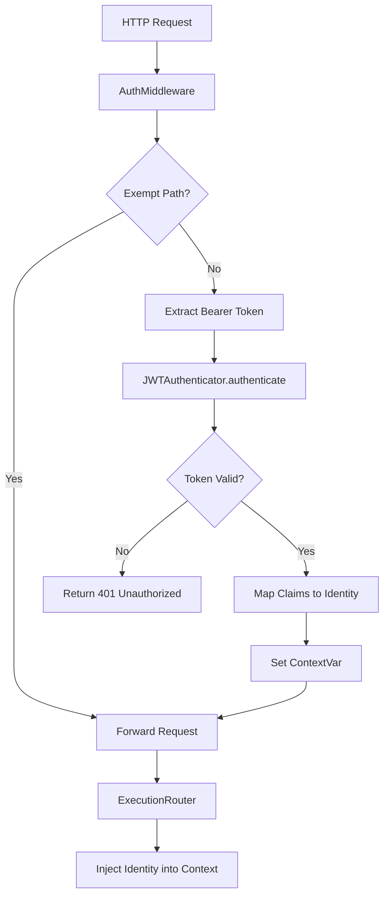

# JWT Authenticator

> Feature spec for code-forge implementation planning.
> Source: extracted from apcore-mcp/docs/srs-apcore-mcp.md
> Created: 2026-04-06

## Purpose

The JWT Authenticator provides a pluggable security layer for HTTP-based MCP transports. It validates incoming JWT (JSON Web Token) bearer tokens, extracts user identity and roles, and injects them into the apcore execution context. This enables fine-grained Access Control (ACL) for tools exposed over the network.

## Scope

**Included:**
- `Authenticator` protocol definition for pluggable backends.
- `JWTAuthenticator` implementation for validating RS256/HS256 tokens.
- `AuthMiddleware` (ASGI) for intercepting HTTP requests and verifying headers.
- Claim mapping (e.g., mapping `sub` to `identity.id`).
- Integration with the apcore `Identity` and `Context` system.
- Support for permissive mode (optional auth) and exempt paths (e.g., `/health`).

**Excluded:**
- JWT issuance or "Login" flows (token must be provided by the client).
- Management of public keys or secrets (provided via configuration).
- Authentication for `stdio` transport (which is inherently secure via local process pipes).

## Core Responsibilities

1. **Token Validator** — Decodes and verifies the signature, expiration (`exp`), audience (`aud`), and issuer (`iss`) of incoming JWTs.
2. **Identity Mapper** — Translates JWT claims into the structured `Identity` object (id, type, roles, attributes) used by apcore's ACL system.
3. **Request Guard** — Intercepts all incoming HTTP/SSE requests and returns `401 Unauthorized` if a valid token is missing (when required).
4. **Context Bridge** — Uses context-local storage to securely pass the authenticated identity from the HTTP middleware to the tool execution handler — Python: `ContextVar`; TypeScript: `AsyncLocalStorage`; Rust: `tokio::task_local!`. Following the JWT-1 unification in apcore-mcp 0.14.0, `authenticate()` is **async in all three SDKs** (Python `async def authenticate`, TypeScript `authenticate(...): Promise<Identity | null>`, Rust `async fn authenticate(...)` under `#[async_trait]`). Python additionally provides a `call_authenticator(auth, headers)` helper that bridges any legacy synchronous `Authenticator` implementations transparently — it inspects the return value and `await`s it only if a coroutine is detected, allowing legacy sync authenticators to coexist with the new async contract during migration.

## Interfaces

### Inputs
- **Authorization Header** (HTTP Client) — The `Bearer <token>` string from the request headers.
- **Verification Key** (Configuration) — The secret or public key used to verify signatures.

### Outputs
- **Identity Object** (apcore Executor) — A populated `Identity` instance attached to the execution context.
- **401 Unauthorized** (HTTP Client) — Error response when authentication fails.

### Dependencies
- **Python:** PyJWT (or jose) — JWT decoding and validation; apcore SDK (Python) — provides `Identity` and `Context`.
- **TypeScript:** jsonwebtoken — JWT decoding and validation; apcore SDK (apcore-js) — provides `Identity` and `Context`.
- **Rust:** jsonwebtoken crate — JWT decoding and validation; apcore SDK (apcore Rust crate) — provides `Identity` and `Context`.

## Data Flow

## Key Behaviors

### Claim Mapping
The authenticator supports a `claim_mapping` configuration that defines which JWT claims correspond to identity fields. By default, `sub` maps to `id`, `roles` to `roles`, and `type` to `type`.

### Permissive Mode
If `require_auth=False` is configured, the middleware will attempt to authenticate but will allow the request to proceed even if no token is provided. In this case, the tool will execute with an `Anonymous` identity, and the Executor's ACL will decide if the call is permitted.

### Stdio Immunity
Authentication is automatically bypassed when using the `stdio` transport, as that transport is only accessible to the local process that launched the server (e.g., the user's IDE or desktop client).

## Constraints

- **Algorithm Whitelist**: Must explicitly configure allowed algorithms (e.g., `["RS256"]`) to prevent algorithm-switching attacks.
- **Header Format**: Must strictly enforce the `Bearer ` prefix (case-insensitive) in the `Authorization` header.
- **Clock Skew**: Should allow a small configurable leeway (e.g., 30s) for clock synchronization issues during expiration checks.

## Error Handling

- **Expired Token**: Returns 401 with `WWW-Authenticate: Bearer error="invalid_token", error_description="The token is expired"`.
- **Invalid Signature**: Returns 401 with generic "Invalid token" message to avoid leaking details about the key.
- **Missing Claims**: If a required claim (like `sub`) is missing, authentication fails.

## Notes

- This feature is essential for "Tool-as-a-Service" deployments where the MCP server is hosted on a remote server.
- It ensures that apcore's powerful ACL system is effective even when tools are called over the public internet.

---

## Contract: JWTAuthenticator.__init__

### Inputs
- key: str, required — secret key (HS256) or public key (RS256); stored for use at authenticate() time; NOT validated at construction
- algorithms: list[str] | None, optional, default=["HS256"] — explicit algorithm whitelist to prevent algorithm-switching attacks
- audience: str | None, optional — expected `aud` claim; when None, aud is not validated
- issuer: str | None, optional — expected `iss` claim; when None, iss is not validated
- claim_mapping: ClaimMapping | None, optional, default=ClaimMapping(id_claim="sub", type_claim="type", roles_claim="roles")
- require_claims: list[str] | None, optional, default=["sub"] — claims enforced for ALL names (standard AND custom, e.g. "org_id")

### Errors
- No validation at construction time — key validity is checked lazily at authenticate() call

### Returns
- On success: JWTAuthenticator instance

### Properties
- async: false
- thread_safe: true
- pure: false
- idempotent: true

---

## Contract: JWTAuthenticator.authenticate

### Inputs
- headers: dict[str, str], required — flat HTTP headers map (NOT the full request); Authorization header extracted as `headers.get("authorization", "")`; Bearer prefix is case-insensitive

### Errors
- Returns None — when Authorization header is missing, not prefixed with "Bearer ", or token is empty
- Returns None — when JWT signature is invalid, token is expired, or any required claim is missing
- Returns None — when id_claim value in payload is None (identity_id=None → returns None, not id="null")
- Never raises (all pyjwt.InvalidTokenError subtypes are caught and logged at DEBUG)

### Returns
- On success: Identity(id=str, type=str, roles=tuple[str, ...], attrs=dict) — id=str(identity_id); type defaults to "user" when type_claim is absent or None in JWT payload; roles=tuple of str coerced from list; attrs populated from attrs_claims when configured
- On failure: None
- `require_auth` policy (whether None triggers 401) is owned by AuthMiddleware, NOT by this class

### Properties
- async: true (uniform across all 3 SDKs since JWT-1 unification in 0.14.0 — Python `async def authenticate`, TypeScript `Promise<Identity | null>`, Rust `async fn` under `#[async_trait]`)
- thread_safe: true
- pure: false
- idempotent: true
