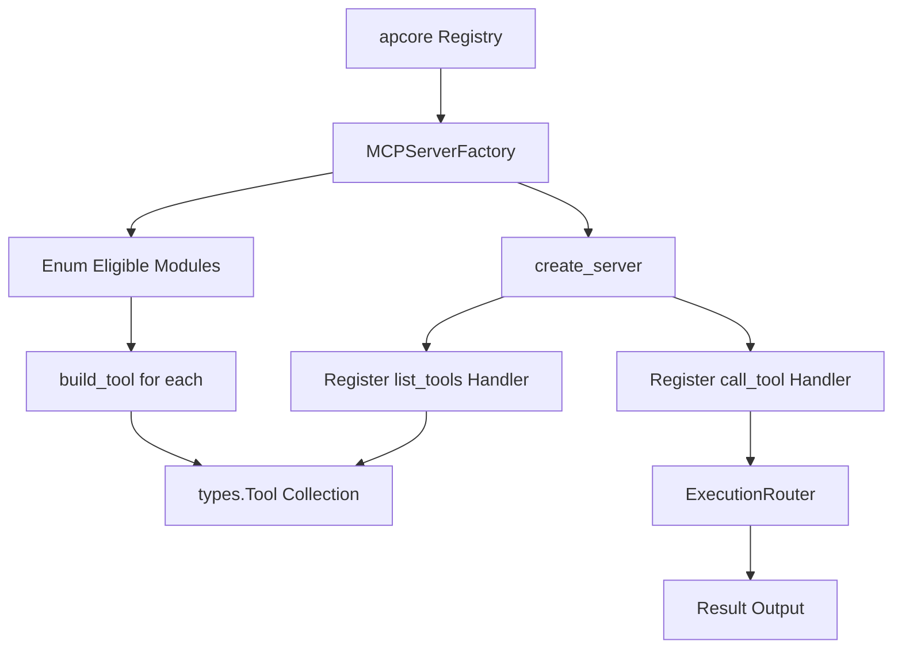

# MCP Server Factory

> Feature spec for code-forge implementation planning.
> Source: extracted from apcore-mcp/docs/tech-design-apcore-mcp.md
> Created: 2026-04-06

## Purpose

The MCP Server Factory is the primary builder that constructs an MCP protocol server instance from an apcore Registry. It handles the mapping of apcore modules to MCP tools, configures protocol-level handlers (e.g., `list_tools`, `call_tool`), and ensures the server is ready to accept transport connections.

## Scope

**Included:**
- Construction of a low-level MCP `Server` instance with defined name and version.
- Transformation of `ModuleDescriptor` metadata into MCP `Tool` objects.
- Registration of core protocol handlers for tool discovery and execution.
- Filtering of tools based on tags or prefixes during construction.
- Integration with the `SchemaConverter` and `AnnotationMapper`.

**Excluded:**
- Selection of the transport layer (handled by `TransportManager`).
- Lifecycle management (handled by `serve()` or the `MCPServer` wrapper).

## Core Responsibilities

1. **Tool Builder** — Iterates over all discovered modules in the registry and generates an MCP-compliant `Tool` object for each.
2. **Schema Inlining** — Leverages the `SchemaConverter` to ensure all tool schemas are self-contained and protocol-compliant.
3. **Annotation Synthesis** — Leverages the `AnnotationMapper` to attach protocol-level behavioral hints to each tool.
4. **Handler Registration** — Defines and registers the `@server.list_tools()` and `@server.call_tool()` callbacks that connect the MCP protocol to internal apcore logic.

## Interfaces

### Inputs
- **Registry** (apcore SDK) — The source of module discovery and metadata.
- **Server Name/Version** (Public API) — Identity metadata for the MCP server.
- **Filters** (Public API) — Optional tag and prefix filters for tool selection.

### Outputs
- **MCP Server Instance** (MCP SDK) — A fully configured, low-level server object ready for transport binding.
- **Tool List** (MCP SDK) — A collection of `Tool` objects used for tool discovery.

### Dependencies
- **MCP SDK (language-equivalent: mcp Python / @modelcontextprotocol/sdk / mcp-sdk Rust crate)** — Provides the `Server`, `Tool`, and `CallToolResult` types.
- **Execution Router** — Used by the tool-call handler to dispatch module execution.

## Data Flow



## Key Behaviors

### Dynamic Tool Construction
The factory constructs `Tool` objects on-demand from the registry. If the registry is updated at runtime (via the `RegistryListener`), the factory can rebuild the tool list without restarting the server.

### Robust Building
If building a tool for one module fails (e.g., due to a malformed schema), the factory logs a warning and continues building tools for the remaining modules rather than crashing the entire server.

### Identity Reporting
The factory ensures that the server correctly identifies itself to clients with a configurable name and version (e.g., `apcore-mcp v1.0.0`).

### Custom Middleware Injection
The public `serve()` entry point accepts an optional user-supplied middleware list:

```python
def serve(
    registry: Registry,
    *,
    name: str = "apcore-mcp",
    version: str = "...",
    transport: str = "stdio",
    middlewares: list[Middleware] | None = None,
    # ... existing parameters
) -> None: ...
```

When `middlewares` is provided, the factory passes the list through to the `ExecutionRouter` (and the underlying apcore `Executor`), which installs them after all built-in middlewares registered by the factory (e.g., logging, tracing, approval enforcement, redaction). This ordering guarantee — **built-ins first, user middlewares after** — ensures user hooks observe already-redacted inputs and participate in error recovery without subverting safety-critical layers. When `middlewares` is `None` or empty, behavior is unchanged. Each entry must be an `apcore.middleware.Middleware` instance; passing non-`Middleware` values raises a configuration error before the server starts.

### Strict Schema Sourcing
When building MCP tools, the factory prefers `Registry.exportSchema(moduleId, strict=true)` if the registry exposes it, using the registry-provided strict schema directly as the MCP `inputSchema`. If the call fails or the registry does not implement `exportSchema`, the factory falls back to local strict post-processing via the Schema Converter (see `docs/features/schema-converter.md`, "Strict Mode for MCP"). Both upstream behaviors yield identical strict output — the registry path is preferred because it avoids a redundant walk.

**Per-SDK status (v0.14.0):**

| SDK | `Registry.exportSchema(strict=true)` | Behavior |
|---|---|---|
| Python | available on `apcore.registry.Registry` | Factory prefers registry path; falls back to local converter on miss/exception. |
| TypeScript | available on `apcore-js`'s `Registry` interface | Factory prefers registry path; falls back to local converter. |
| Rust | NOT available — apcore Rust's `Registry::export_schema(name)` does not accept a `strict` parameter | Factory always uses local strict post-processing via the Schema Converter. Aligning the Rust apcore Registry API with Python/TS is deferred (A-D-012, see CHANGELOG 0.14.0 deferred section — pending next apcore Rust crate release). |

The output of all three SDKs is functionally equivalent strict JSON Schema; the divergence is purely in *which layer performs the strict transformation*, not in the result.

## Constraints

- **Name Constraint**: The server name must be non-empty and must not exceed 255 characters.
- **Protocol Limits**: Tool names are derived from `module_id` and must comply with the protocol's naming restrictions.
- **Bijective Mapping, with one classification exception**: each module in the registry (post-filtering)
  results in exactly one MCP primitive — but that primitive is a **tool** for every module *except* the
  six read-only `system.health.*` / `system.usage.*` / `system.manifest.*` modules, which project as a
  **resource** or **resource template** instead. See
  [System Module Projection](#system-module-projection-resources-vs-tools) below. Prior to v0.19.0 this
  constraint had no exception and all nine `system.*` modules (including the three write
  `system.control.*` ones) were projected as tools — corrected per aiperceivable/apcore-mcp#15.

## System Module Projection: resources vs. tools

`system.*` modules are classified into MCP primitives by **`module_id` prefix only**
(PROTOCOL_SPEC §6.6.2). An adapter **SHOULD NOT** introduce its own classification mechanism —
reserved tags, environment variables, or an adapter-level switch — because the classification is a
protocol-level fact about the module (read-only observability vs. a side-effecting write), not a
deployment choice.

| Module | Primitive | URI / name |
|---|---|---|
| `system.health.summary` | resource | `apcore://system.health.summary` |
| `system.health.module` | resource template | `apcore://system.health.module/{module_id}` |
| `system.usage.summary` | resource | `apcore://system.usage.summary{?period}` |
| `system.usage.module` | resource template | `apcore://system.usage.module/{module_id}{?period}` |
| `system.manifest.full` | resource | `apcore://system.manifest.full` |
| `system.manifest.module` | resource template | `apcore://system.manifest.module/{module_id}` |
| `system.control.update_config` | tool | `system.control.update_config` |
| `system.control.reload_module` | tool | `system.control.reload_module` |
| `system.control.toggle_feature` | tool | `system.control.toggle_feature` |

The three `system.control.*` modules have side effects — that is what a tool is — and stay tools with
the approval bridge wired on the tool-call path exactly as before. The six read-only modules are
excluded from `build_tools()`'s output and are instead served by the resource-handler registration step
(below), whichever `module_id` prefix filter or resource-handler-only variant of that step the SDK
exposes.

**A `resources/read` on any `apcore://system.*` URI MUST be dispatched through the same
Activation → ACL → Approval → Executor pipeline as a `tools/call`** on the corresponding module — never
through a second, resource-only path that bypasses ACL or the audit trail. Concretely: the parsed
module ID and arguments (a `module_id` path segment for the three `*.module` templates, an optional
`period` query parameter for the two usage variants) are routed through the same
`ExecutionRouter.handleCall` / `handle_call` dispatcher `register_handlers`/`registerHandlers` already
uses for tool calls.

This classification is also the reachability signal the
[System Management Extension](./system-management-extension.md) (`com.aiperceivable/management`,
aiperceivable/apcore-mcp#16 Phase A) advertises in `capabilities.extensions` — see that document for
the negotiation shape. Declaring or omitting that extension has no effect on whether any of the nine
modules above are reachable; see its Design Constraint section.

### Unprotected control surface warning

At `serve()` / `async_serve()` startup, once the `Executor` is fully assembled (ACL, approval handler
and policy all wired), the adapter **MUST** call `Executor.governanceState()` /
`Executor::governance_state()` and, when `.unprotectedControlSurface` /
`.unprotected_control_surface` is `true`, emit a prominent startup warning naming which of the
underlying `GovernanceState` observations are unmet (no ACL configured, ACL configured but its
built-in gate not wired into the running strategy, no approval handler and no strict
`ExecutionPolicy`, or not every `system.control.*` module declaring `requiresApproval`) and the
specific configuration that closes each gap. This is a warning only — it MUST NOT prevent the server
from starting. See aiperceivable/apcore-mcp#15(b); the underlying accessor was itself blocked on
aiperceivable/apcore#97 until apcore 0.28.0.

## Error Handling

- **Registry Empty**: If no modules are found, the factory logs a warning and produces an empty tool list rather than an error.
- **Duplicate Registration**: Idempotently handles registration of tool handlers to prevent multiple definitions.

## Extension Integration

The factory integrates with apcore's `ExtensionManager` (see `apcore/docs/features/extension-system.md`) so applications can customize protocol-level behavior without forking the factory. This integration is mediated by the Extension Bridge (see `./extension-bridge.md`), which translates MCP-specific plugin points into apcore extension-point registrations and owns load-order policy.

### `serve()` Signature Extension
The top-level `serve()` entry point accepts an optional `extensions` parameter and forwards it to the factory:

```python
def serve(
    registry,
    *,
    extensions: "ExtensionManager | None" = None,
    schema_converter: "SchemaConverter | None" = None,
    annotation_mapper: "AnnotationMapper | None" = None,
    error_mapper: "ErrorMapper | None" = None,
    ...
) -> None: ...
```

When `extensions` is provided, the factory invokes `extensions.apply(registry, executor)` before constructing the MCP server, so the Executor it wraps already carries caller-supplied ACLs, approval handlers, module validators, discoverers, span exporters, and middleware.

### Pass-Through to Executor
If `serve()` receives a bare `Registry` (not an `Executor`), the factory builds the default `Executor(registry, strategy=strategy)` and then calls `ExtensionManager.apply(registry, executor)`. If `serve()` receives an `Executor` directly, the factory still invokes `apply()` on it; callers who have already wired extensions SHOULD pass the same `ExtensionManager` to avoid double-application. Duplicate wiring is idempotent for single-cardinality points but additive for multi-cardinality points (middleware, span exporters).

### Custom Adapter Hooks
In addition to apcore's built-in extension points, the factory exposes three MCP-specific hooks:

| Hook | Replaces | Expected type |
|------|----------|---------------|
| `schema_converter` | Default `SchemaConverter` | `SchemaConverter` protocol |
| `annotation_mapper` | Default `AnnotationMapper` | `AnnotationMapper` protocol |
| `error_mapper` | Default `ErrorMapper` | `ErrorMapper` protocol |

> **Not implemented (0.17.x).** The three hooks below are a design target. No SDK accepts them —
> not on `serve()`, not on `MCPServerFactory`. See the Status note in `extension-bridge.md`.

The design is that they may be supplied directly to `serve()` as keyword arguments or registered on the `ExtensionManager` under the MCP-reserved extension points `mcp_schema_converter`, `mcp_annotation_mapper`, and `mcp_error_mapper` (all single-cardinality), with the Extension Bridge resolving the effective instance using the precedence: explicit kwarg > `ExtensionManager` registration > built-in default.

### Load Order
The factory applies customizations in a strict order so extensions observe a stable baseline:

1. `ExtensionManager.apply(registry, executor)` wires user-supplied discoverers, validators, ACLs, approval handlers, span exporters, and user middleware onto the Executor **first** — extensions run before any built-in MCP middleware is layered on.
2. The factory then installs its **built-in middleware** (tracing, redaction, preflight adapters) so built-ins run closest to the module boundary and cannot be shadowed by extensions.
3. MCP-specific adapter hooks (`schema_converter`, `annotation_mapper`, `error_mapper`) are resolved and bound to the factory instance.
4. Protocol handlers (`list_tools`, `call_tool`) are registered on the MCP Server, wrapping the now-configured Executor.

This ordering guarantees that extensions can observe every tool call but cannot bypass apcore-mcp's core security and observability invariants.

## Notes

- This component is the bridge that converts the "idea" of a module in apcore into the "reality" of a tool in the MCP protocol.
- It is designed to be language-agnostic in its logic, enabling identical behavior across Python, TypeScript, and Rust implementations.

---

## Composition Note

`MCPServerFactory` does NOT expose a single composite `build()` method. The factory composes through three discrete steps that callers (or `serve()` / `async_serve()`) invoke in order:

```
create_server(name, version) → server
build_tools(registry, options) → tools
register_handlers(server, tools, router, ...) → server with handlers
```

The three Contract blocks below define each step. For HTTP transport, `build_init_options(server, name, version)` produces the `InitializationOptions` object passed to the transport layer.

---

## Contract: MCPServerFactory.create_server

### Inputs
- name: str, required, validates[non-empty, max 255 chars], reject_with=ValueError
- version: str, optional, default="0.1.0"
- management_surfaces: `{health, usage, manifest, control}` of bool, optional, default=None — **since v0.19.0**. When any field is `True`, `capabilities.extensions["com.aiperceivable/management"]` is added with `surfaces` set to the true fields and `protocolVersion` set to the PROTOCOL_SPEC version this adapter's `system.*` projection targets (see [System Management Extension](./system-management-extension.md)). When omitted or all-`False`, `capabilities.extensions` is absent entirely — never present with an empty `surfaces` array. Passing `None`/omitting it is fully backward compatible with pre-v0.19.0 callers.

### Errors
- ValueError — when name is empty or exceeds 255 chars

### Returns
- On success: MCP `Server` instance with no tools or handlers attached yet — caller proceeds to `build_tools` then `register_handlers`

### Properties
- async: false
- thread_safe: false
- pure: false
- idempotent: false

---

## Contract: MCPServerFactory.build_tools

### Inputs
- registry: Registry, required (duck-typed) — must expose `list(tags?, prefix?)` and `get_definition(module_id)` methods
- options: BuildToolsOptions, optional — fields:
  - tags: list[str] | None — filter modules by tags
  - prefix: str | None — filter modules by ID prefix
  - strict: bool, default=True — when True, prefers registry.export_schema(strict=True); falls back to local SchemaConverter

### Errors
- ValueError — when a discovered module_id starts with reserved `__apcore_` prefix (hard config error, not silently skipped)
- Logs WARNING and skips the module — when build_tool raises for a non-reserved-prefix error (build continues for remaining modules)

### Returns
- On success: list[Tool] — MCP Tool objects ready to register via `register_handlers`
- On empty registry: empty list (warning logged)
- Strict schema sourcing: tries `registry.export_schema(module_id, strict=True)` first; falls back to local SchemaConverter on miss/exception; Rust always uses local SchemaConverter (apcore Rust Registry lacks strict parameter)
- **Since v0.19.0**: excludes the six read-only `system.health.*` / `system.usage.*` / `system.manifest.*` module IDs — these are projected as resources/resource-templates instead (see [System Module Projection](#system-module-projection-resources-vs-tools)). `system.control.*` modules are unaffected and still produce a Tool.

### Properties
- async: false
- thread_safe: false
- pure: false
- idempotent: false

---

## Contract: serve

`serve()` is the top-level entry point and its keyword surface is large — 37 parameters in Python at
0.17.2, 32 for `async_serve()` (which drops the four transport/bind parameters and `on_startup` /
`on_shutdown`). The groups below are the authoritative list; the SRS §7.8 / §8.1.1 and tech design
§7.1 signatures are summaries and MUST NOT be read as narrower.

### Inputs
- registry: Registry | Executor, required (duck-typed) — Python names the parameter `registry_or_executor`
- **Identity:** name (default `"apcore-mcp"`), version
- **Transport:** transport (default `"stdio"`; one of `"stdio"`, `"streamable-http"`, `"sse"`), host (default `"127.0.0.1"`), port (default `8000`) — `serve()` only
- **Lifecycle:** on_startup, on_shutdown — `serve()` only
- **Exposure:** tags, prefix, dynamic (default false), validate_inputs (default false)
- **Explorer:** explorer (default false), explorer_prefix (default `"/explorer"`), allow_execute (default false), explorer_title, explorer_project_name, explorer_project_url
- **Auth:** authenticator, require_auth (default **true**), exempt_paths — a **set** of strings, defaulting to `{"/health", "/metrics"}` when omitted, not an empty set
- **Approval:** approval_handler, approval_store, approval_notify
- **Output:** output_formatter, output_format, redact_output (default true), strategy, trace (default false)
- **Pipeline:** middleware (**singular** — `middlewares` is not accepted by any SDK), acl, observability (default false)
- **Async tasks:** async_tasks (default true), async_max_concurrent (default 10), async_max_tasks (default 1000)
- **Diagnostics:** log_level, metrics_collector

Not accepted by any SDK: `extensions`, `schema_converter`, `annotation_mapper`, `error_mapper` — see
the Custom Adapter Hooks note above.

### Errors
- ValueError — when middleware contains non-Middleware values (raised before server starts)
- OSError — when transport bind fails (port already in use)

### Returns
- On success: None — blocks until server exits (stdio) or SIGINT/SIGTERM (HTTP)
- On failure: raises (transport errors propagated)

### Properties
- async: false
- thread_safe: false
- pure: false
- idempotent: false

---

## Contract: async_serve

### Inputs
- Same as `serve()` — yields an ASGI app for embedding in a larger application

### Errors
- Same as `serve()`

### Returns
- On success: async context manager yielding a Starlette ASGI app
- On failure: raises

### Properties
- async: true
- thread_safe: false
- pure: false
- idempotent: false

---

## Contract: MCPServerFactory.register_handlers

### Inputs
- server: Server, required — MCP low-level Server instance
- tools: list[Tool], required — MCP Tool objects to expose via list_tools
- router: Any, required (duck-typed) — must expose `async handle_call(name, arguments, extra?) -> tuple`
- async_bridge: AsyncTaskBridge | None, optional — when provided, five reserved meta-tools are appended to the tools list (four `__apcore_task_*` task-lifecycle tools plus `__apcore_module_preview` for executor-validate preview, v0.15+) and async-hinted modules are routed through the bridge
- descriptor_lookup: callable | None, optional — used to detect async-hinted modules; required when async_bridge is set for async routing to work

### Errors
- No errors raised during registration (errors surface at call time)

### Returns
- On success: None — side effect: registers list_tools and call_tool handlers on the server; identity is propagated from ContextVar/AsyncLocalStorage into the tool execution context

### Properties
- async: false
- thread_safe: false
- pure: false
- idempotent: false

---

## Contract: MCPServerFactory rich_description option

> Constructor option introduced in 0.15.0. When enabled, tool descriptions are rendered through the apcore-toolkit Markdown formatter so MCP clients receive a structured, human-readable description instead of the raw `descriptor.description` string. Names per language: Python `rich_description: bool`, TypeScript `richDescription: boolean`, Rust `with_rich_description(bool)` builder method.

### Inputs
- rich_description: bool, optional, default=False — when True, every tool's `description` field is replaced by `render_module_markdown(descriptor)` output; `display_overlay` (when present) takes precedence over the rendered Markdown for caller-supplied final overrides
- toolkit availability: when `rich_description=True` AND apcore-toolkit is not installed, the factory falls back silently to `descriptor.description` and emits a one-time WARNING log line per process

### Errors
- No errors raised — fallback-on-missing-toolkit is by design

### Returns
- On success: side effect on each tool produced by `build_tools`/`build_tool` — the tool's `description` field is rendered Markdown when `rich_description=True` AND toolkit is available; otherwise unchanged

### Properties
- async: false
- thread_safe: true (read-only after construction)
- pure: false (depends on toolkit availability)
- idempotent: true

### Display Precedence
The overlay lives at `descriptor.display["mcp"]`, with `descriptor.metadata["display"]["mcp"]` as a
compatibility fallback for configs that embedded it in metadata. Python and TypeScript read the
metadata path only; Rust prefers the top-level `descriptor.display` and falls back to metadata.
There is no `annotations.extra["display_overlay"]` key — no SDK reads one.

Description resolution, highest priority first:
1. `display.mcp["description"]` (operator-typed hard override) — wins even when `rich_description=True`
2. Rendered Markdown from `render_module_markdown(descriptor)` — used when `rich_description=True` AND the toolkit is available and the render succeeds
3. `descriptor.description` (raw) — used when `rich_description=False`, the toolkit is unavailable, or the render returned nothing

Whatever wins, `display.mcp["guidance"]` is then appended as `"\n\nGuidance: {text}"`.

The overlay also carries `display.mcp["alias"]`, which replaces the tool name (`module_id` otherwise).
It is applied verbatim — not sanitized, not length-capped. See tech design ADR-03.

---

## Contract: MCPServerFactory.prepare

> Static method introduced in 0.15.0 (TypeScript only — Python/Rust have synchronous toolkit loading and do not require this). Primes the apcore-toolkit Markdown renderer's module cache so downstream `buildTool` calls can render Markdown synchronously.

### Inputs
- (no parameters)

### Errors
- No errors raised — silently no-ops when apcore-toolkit is not installed (logs at DEBUG)
- Toolkit import errors are caught and logged at WARNING; subsequent `buildTool` calls fall back to raw description

### Returns
- On success: Promise<void> — resolves once the dynamic `import("apcore-toolkit/markdown")` has completed and the markdown module is cached
- On failure: never rejects (silently swallows toolkit-load errors per fallback policy)

### Properties
- async: true
- thread_safe: true (idempotent prime; concurrent calls share the same in-flight Promise)
- pure: false (mutates a module-level cache)
- idempotent: true (multiple calls share cached state)

### Usage
Call `await MCPServerFactory.prepare()` once at application startup BEFORE any synchronous `buildTool` invocations when `richDescription: true` is in effect; without this prime, the first `buildTool` call falls back to raw description because the renderer module has not yet loaded.
