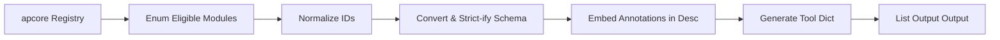

# OpenAI Converter

> Feature spec for code-forge implementation planning.
> Source: extracted from apcore-mcp/docs/tech-design-apcore-mcp.md
> Created: 2026-04-06

## Purpose

The OpenAI Converter transforms apcore modules into OpenAI-compatible tool definitions. It allows any apcore module to be used directly with OpenAI's `chat.completions` API as a function-calling tool. This enables a unified "develop once, use everywhere" approach across both MCP and OpenAI ecosystems.

## Scope

**Included:**
- Conversion of `ModuleDescriptor` to `ChatCompletionTool` dict format.
- Module ID normalization (e.g., converting dots `.` to hyphens `-`).
- Support for OpenAI "Strict Mode" schema transformations.
- Optional embedding of apcore annotations into tool descriptions.
- Filtering of tools based on tags or prefixes during conversion.
- Zero-dependency execution (produces plain dictionaries).

**Excluded:**
- Implementation of the OpenAI API client.
- Handling of tool-call results (managed by the calling application).

## Core Responsibilities

1. **Schema Adapter** — Converts Pydantic-generated schemas into the specific format expected by OpenAI (using the `SchemaConverter`).
2. **Strict Mode Transformer** — If enabled, modifies the JSON Schema to comply with OpenAI's strict requirements (no `additionalProperties`, all fields required/nullable, no defaults).
3. **ID Normalizer** — Replaces dot notation (e.g., `image.resize`) with hyphens (e.g., `image-resize`) to meet OpenAI's character constraints.
4. **Description Enhancer** — Appends metadata about tool behaviors (like `destructive`) to the human-readable description string to inform the model.

## Interfaces

### Inputs
- **Registry / Executor** (apcore SDK) — Source for module discovery and metadata.
- **Strict Mode Toggle** (Boolean) — Whether to apply OpenAI's strict schema rules.
- **Embed Annotations Toggle** (Boolean) — Whether to append behavioral metadata to descriptions.

### Outputs
- **List[Dict[str, Any]]** (OpenAI API) — A list of dictionaries ready to be passed to the OpenAI SDK.

### Dependencies
- **Schema Converter** — Used to resolve and inline schema references.
- **Annotation Mapper** — Used to generate the description suffix.

## Data Flow

## Key Behaviors

### Strict Mode Schema Transformation
When `strict=True`, the converter performs recursive transformation:
- Set `additionalProperties: False`.
- Move all property names to the `required` array.
- Convert any property that wasn't originally required into a union type `[type, "null"]`.
- Strip all `default` values and non-standard `x-*` keys.

### Per-SDK Defaults (v0.14.0)
- Python: `OpenAIConverter()` — strict default `false`; pass `strict=true` per call.
- TypeScript: `convertRegistry(registry, { strict: true })` — strict default `true` (changed in 0.14.0 per OC-1).
- Rust: explicit `strict: bool` argument required on `convert_registry`/`convert_descriptor`; no implicit default.

### Module ID Normalization
Since OpenAI function names can only contain `[a-zA-Z0-9_-]`, dots are replaced with hyphens. The converter must ensure this mapping is bijective and reversible to allow the calling application to map the tool call back to the original `module_id`.

### Zero-Dependency Output
The converter must return only standard Python types (dict, list, str, etc.) and should NOT import the `openai` package. This ensures maximum compatibility and avoids version conflicts in the host application.

## Constraints

- **Name Length**: OpenAI function names must be under 64 characters.
- **JSON Schema Version**: OpenAI supports a specific subset of JSON Schema; the converter must avoid incompatible features (like `format` in strict mode).
- **Token Efficiency**: The converter should omit redundant information (like default values or empty description suffixes) to minimize token consumption.

## Error Handling

- **Incompatible Schema**: If a schema cannot be converted to OpenAI's strict format (e.g., it uses unsupported keywords), the converter logs a warning and provides the best possible non-strict alternative.
- **ID Conflict**: If normalization results in name collisions (e.g., `a.b` and `a-b` both become `a-b`), the converter raises a `ValueError`.

## Notes

- This component is a pure-function utility that can be used independently of the MCP server.
- It enables legacy OpenAI-based agents to leverage the same tool library as modern MCP-based agents.

---

## Contract: OpenAIConverter.convert_registry

### Inputs
- registry: Any, required (duck-typed) — must expose `list(tags?, prefix?)` and `get_definition(module_id)` methods; NOT a raw JSON Value
- embed_annotations: bool, optional, default=False — when True, appends annotation suffix to descriptions
- strict: bool, optional, default=False (Python; TypeScript default is True per OC-1)
- tags: list[str] | None, optional — filter passed to registry.list()
- prefix: str | None, optional — filter passed to registry.list()

### Errors
- ValueError — when normalization produces name collisions (e.g., `a.b` and `a-b` both → `a-b`); raises with collision details
- Silently skips modules where `registry.get_definition()` returns None (race condition guard)

### Returns
- On success: list[dict[str, Any]] — each dict follows OpenAI function-calling format: `{"type": "function", "function": {"name": str, "description": str, "parameters": dict, "strict": bool?}}`
- `strict: true` key only present in function dict when `strict=True`
- On failure: raises ValueError for collisions; other errors propagated from registry

### Properties
- async: false
- thread_safe: true
- pure: false
- idempotent: true

---

## Contract: OpenAIConverter._apply_strict_mode

### Inputs
- schema: dict[str, Any], required — JSON Schema dict; deep-copied before transformation

### Errors
- No exceptions raised for valid schema dicts; unexpected types may propagate

### Returns
- On success: dict[str, Any] — new schema with strict transformations applied in pipeline order:
  1. Promote `x-llm-description` → `description` (before stripping)
  2. Strip all `x-*` extension keys
  3. Strip all `default` values
  4. Set `additionalProperties: false` on all objects
  5. Move all property names to `required` array (sorted alphabetically)
  6. Optional properties (not originally required) become nullable: wrapped in `{oneOf: [original, {type: "null"}]}`; optional `$ref` properties wrapped as `{oneOf: [original, {type: "null"}]}`
  7. Recurse into nested objects, array items, oneOf/anyOf/allOf, $defs

### Properties
- async: false
- thread_safe: true
- pure: true
- idempotent: true

---

## Contract: to_openai_tools

### Inputs
- registry: Any, required (duck-typed) — same contract as OpenAIConverter.convert_registry
- strict: bool, optional, default=False
- embed_annotations: bool, optional, default=False
- tags: list[str] | None, optional
- prefix: str | None, optional

### Errors
- ValueError — for name collisions (same as convert_registry)

### Returns
- On success: list[dict[str, Any]] — delegates to OpenAIConverter().convert_registry()
- On failure: raises

### Properties
- async: false
- thread_safe: true
- pure: false
- idempotent: true

---

## Contract: OpenAIConverter rich_description option

> Parameter introduced in 0.15.0 on `convert_registry` / `convertRegistry` / `convert_registry_with_options` and on the per-module `convert_descriptor` / `convertDescriptor` paths. When enabled, the tool's `description` field is rendered through the apcore-toolkit Markdown formatter so OpenAI receives a structured description instead of `descriptor.description`. Mirrors the `MCPServerFactory rich_description` option for parity across the MCP and OpenAI surfaces.

### Inputs
- rich_description: bool, optional, default=False (Python: `rich_description`; TypeScript: `richDescription`; Rust: field on `ConvertOptions`) — when True, replaces the OpenAI tool's `description` with `render_module_markdown(descriptor)` output
- toolkit availability: when `rich_description=True` AND apcore-toolkit is not installed, the converter falls back silently to `descriptor.description` and emits a one-time WARNING log line per process

### Errors
- No errors raised — fallback-on-missing-toolkit is by design

### Returns
- On success: side effect on the per-tool `description` field — rendered Markdown when `rich_description=True` AND toolkit available; otherwise unchanged
- On rendered-description + `embed_annotations=True`: the annotation suffix is appended AFTER the rendered Markdown (separated by a blank line) so suffix semantics are preserved

### Properties
- async: false
- thread_safe: true (read-only after construction)
- pure: false (depends on toolkit availability)
- idempotent: true

---

## Contract: ConvertOptions (Rust)

> Public struct introduced in 0.15.0. Aggregates all per-call conversion options for the `*_with_options` method family on the Rust `OpenAIConverter`. Mirrors the TypeScript `ConvertOptions` interface and the Python kwargs surface, providing a single ergonomic carrier for callers that want non-default behavior.

### Inputs (struct fields)
- strict: bool, required — apply OpenAI strict-mode schema transformations
- embed_annotations: bool, optional, default=false — append annotation suffix to descriptions
- rich_description: bool, optional, default=false — render Markdown via apcore-toolkit when available
- tags: Option<Vec<String>>, optional — filter modules by tags (forwarded to `registry.list`)
- prefix: Option<String>, optional — filter modules by ID prefix (forwarded to `registry.list`)

### Errors
- No errors raised — pure data carrier

### Returns
- On success: `ConvertOptions` instance ready for `convert_registry_with_options(registry, &options)` / `convert_descriptor_with_options(descriptor, &options)`
- On failure: not applicable (struct construction)

### Properties
- async: false
- thread_safe: true
- pure: true
- idempotent: true

### Default
`ConvertOptions::default()` returns `{strict: false, embed_annotations: false, rich_description: false, tags: None, prefix: None}`. Callers using the default Boolean strict semantics SHOULD use the non-`_with_options` `convert_registry(registry, strict)` form for clarity.

---

## Contract: OpenAIConverter::convert_registry_with_options (Rust)

> Method introduced in 0.15.0. Variant of `convert_registry` that accepts a `ConvertOptions` carrier instead of individual Boolean parameters. Necessary for `rich_description`, `embed_annotations`, `tags`, and `prefix` because Rust does not support keyword arguments.

### Inputs
- registry: &Registry, required — must expose `list(tags?, prefix?)` and `get_definition(module_id)` methods
- options: &ConvertOptions, required

### Errors
- ConverterError::Collision — when `module_id` normalization produces name collisions (e.g., `a.b` and `a-b` both → `a-b`); error includes both collided ids
- ConverterError::Schema — when a module's schema cannot be parsed or strict-mode transformation fails

### Returns
- On success: `Result<Vec<serde_json::Value>, ConverterError>` — each value is an OpenAI function dict
- On failure: returns `Err(ConverterError)` (Rust does not raise)

### Properties
- async: false
- thread_safe: true
- pure: false (depends on registry state)
- idempotent: true

---

## Contract: json_entry_to_scanned_module (Rust)

> Public adapter introduced in 0.15.0. Builds a `ScannedModule` value from a `(module_id, &serde_json::Value)` pair so the apcore-toolkit Markdown renderer can consume registry exports that arrive as JSON (e.g., from `registry.export(...)` or off-disk caches) without round-tripping through the typed `ModuleDescriptor`.

### Inputs
- module_id: &str, required
- entry: &serde_json::Value, required — must be a JSON object containing at minimum `description`; may contain `metadata`, `annotations`, `input_schema`, `output_schema`

### Errors
- No errors raised — missing fields default to empty values:
  - missing/non-string `description` → `""`
  - missing/non-object `metadata` → `{}`
  - missing/non-object `annotations` → empty annotation set
  - missing `input_schema` → `Value::Object(Map::new())`

### Returns
- On success: `ScannedModule` with `id: module_id.to_string()`, plus `description`, `metadata`, `annotations`, `input_schema`, `output_schema` extracted from `entry`
- On failure: not applicable (no error path)

### Properties
- async: false
- thread_safe: true
- pure: true
- idempotent: true
