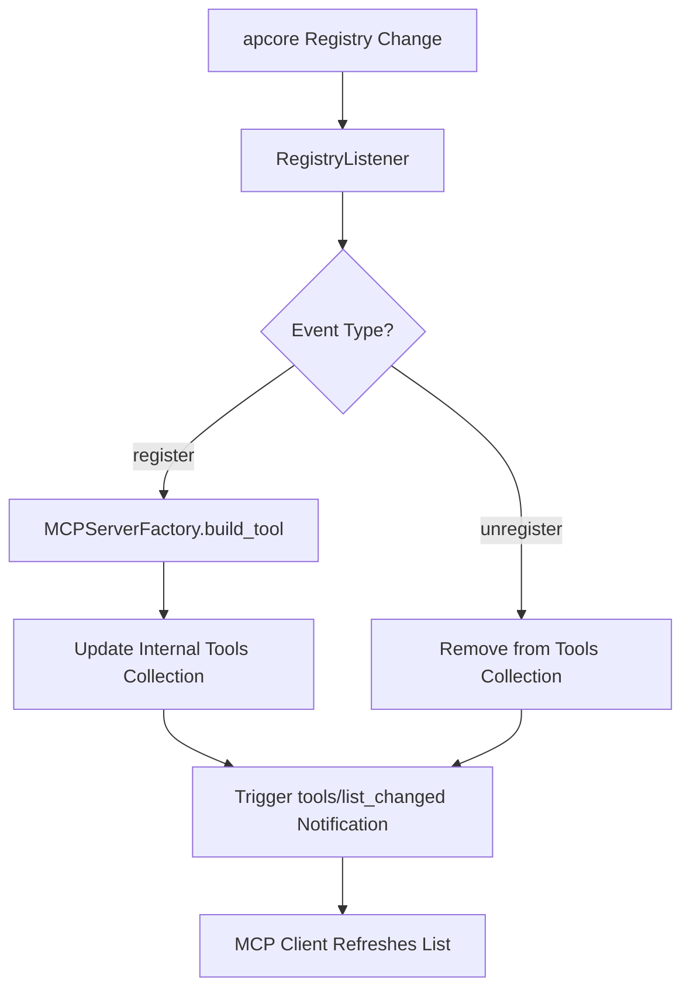

# Registry Listener

> Feature spec for code-forge implementation planning.
> Source: extracted from apcore-mcp/docs/tech-design-apcore-mcp.md
> Created: 2026-04-06

## Purpose

The Registry Listener enables "hot reloading" of MCP tools by monitoring an apcore Registry for runtime changes. When modules are added, removed, or updated in the underlying registry, the listener ensures that the MCP server's tool list is automatically synchronized and that connected clients are notified of the change.

## Scope

**Included:**
- Monitoring `register` and `unregister` events from an apcore Registry.
- Dynamic addition/removal of tools from the active MCP tool list.
- Sending `notifications/tools/list_changed` to connected MCP clients.
- Thread-safe management of the internal tool list.
- Throttling and debouncing of rapid registration events.

**Excluded:**
- Implementation of the Registry (provided by the apcore SDK).
- Modification of existing tool logic (only handles the list of available tools).

## Core Responsibilities

1. **Event Monitor** — Subscribes to the event system of an apcore Registry to receive notifications when modules are added or removed.
2. **Tool Sync** — Automatically rebuilds the specific tool entry (using the `MCPServerFactory`) when a module is registered and updates the server's internal collection.
3. **Client Notifier** — Triggers the protocol-specific notification (`notifications/tools/list_changed`) that informs MCP clients (like Claude Desktop) to refresh their tool list.
4. **Safety Lock** — Uses synchronization primitives (e.g., `asyncio.Lock`) to ensure the tool list remains consistent during concurrent updates and client requests.

## Interfaces

### Inputs
- **Registry Events** (apcore SDK) — `on_register` and `on_unregister` callbacks from the source Registry.

### Outputs
- **Tool List Notification** (MCP SDK) — A protocol notification broadcast to all connected clients.
- **Updated Tool Collection** (MCPServerFactory) — The modified set of tools used for discovery requests.

### Dependencies
- **apcore SDK (language-equivalent: apcore-python / apcore-js / apcore Rust crate)** — Provides the Registry and its event system.
- **MCP SDK (language-equivalent: mcp Python / @modelcontextprotocol/sdk / mcp-sdk Rust crate)** — Provides the server-side notification API.

## Data Flow

## Key Behaviors

### Dynamic Synchronization
The listener ensures that modules added via dynamic discovery (e.g., a new file appearing in an extensions directory) are instantly reflected as tools in the AI agent's interface without restarting the server.

### Tool List Atomicity
All updates to the internal tool dictionary are performed as an atomic operation. This prevents race conditions where a client might see a partial or inconsistent tool list during a discovery request.

### Notification Debouncing
To avoid "notification storms" during bulk registration (e.g., at startup or when loading a complex plugin), the listener can debounce `list_changed` notifications, sending only one message after a short quiet period.

## Client Notification Bridge

> **Status (0.17.x): NOT IMPLEMENTED in any SDK.** Everything in this section — emission,
> the 100 ms debounce window, per-session ACL filtering, and HTTP fan-out — is a design target.
> Measured: no SDK contains a single call site that sends `notifications/tools/list_changed`.
> All three nonetheless advertise `tools: { listChanged: true }` in the initialize response
> (Python `factory.py:504`, TypeScript `factory.ts:132`, Rust `factory.rs:712`), so a client that
> trusts the capability will wait for a refresh signal that never arrives and keep serving a stale
> tool list after a runtime `register`/`unregister`.
>
> What *does* work today is the listener's internal half: the register/unregister subscription and
> the rebuild of the active tool collection, so `tools/list` returns the correct set **when the
> client asks again**. Until the bridge lands, treat dynamic registration as poll-only and consider
> whether advertising `listChanged: true` is honest for your deployment.

The Client Notification Bridge translates apcore Registry `register`/`unregister` events into MCP `notifications/tools/list_changed` messages delivered to connected clients.

### Emission Triggers
- On every successful `register` event (after the tool is added to the active tool collection).
- On every successful `unregister` event (after the tool is removed).
- Failed sync operations (e.g., `build_tool()` raises) MUST NOT emit notifications — tool list state remains unchanged.

### Debouncing
- The listener coalesces rapid register/unregister events within a 100ms quiet window.
- An event schedules (or resets) a single pending notification timer; only one `notifications/tools/list_changed` is sent per quiet window.
- The debounce timer is per-session for multi-session transports; stdio uses a single global timer.

### Per-Session ACL Filtering
- Before dispatching a notification to a session, the bridge evaluates the session's ACL (derived from auth context / session capabilities) against the changed tool set.
- If none of the added/removed tools are visible to the session under its ACL, the notification is suppressed for that session.
- ACL evaluation reuses the same filter logic that scopes `tools/list` responses, ensuring clients never learn of tools they cannot see.

### Transport Behavior
- **stdio (single session):** Exactly one peer. The listener holds a direct reference to the active session; notifications are dispatched inline on the event loop without fan-out.
- **HTTP (multi-session):** The listener maintains a session registry. Each debounced notification is fanned out to all active sessions, with per-session ACL filtering applied independently. Sessions that disconnected during the debounce window are dropped silently.
- Notification send failures on any individual session are logged and do not affect delivery to other sessions.

## Constraints

- **Registry Compatibility**: Requires an apcore Registry that supports event listeners (standard in apcore >= 0.19.0 (language-equivalent)).
- **Client Support**: Not all MCP clients may implement the `list_changed` notification; the listener remains functional even if clients ignore the message. (Moot until the Client Notification Bridge above is implemented — today no SDK sends one.)
- **Async Safety**: Callbacks from the Registry (which may be synchronous) must be safely bridged to the server's asynchronous event loop.

## Error Handling

- **Sync Failure**: If building a tool for a new module fails, the listener logs the error and does NOT update the tool list or notify the client, preserving the server's stability.
- **Listener Leak**: The listener must be properly detached when the server shuts down to prevent memory leaks.

## Notes

- This feature is critical for developer productivity, allowing for live-coding of modules that are immediately usable in the agent UI.
- It enables advanced use cases like server-side "plugin stores" or dynamic capability discovery.

---

## Contract: RegistryListener.start

### Inputs
- No parameters

### Errors
- No exceptions raised; safe to call multiple times (idempotent — returns immediately if already active)

### Returns
- On success: None — side effect: registers `_on_register` callback on registry "register" event and `_on_unregister` on "unregister" event; sets `_active = True`
- Idempotent: if already started, returns without re-registering

### Properties
- async: false
- thread_safe: per-language — Rust: **true** (uses `AtomicBool::compare_exchange` on `_active`, safe to invoke from multiple threads). Python/TS: **false** (relies on single-threaded event-loop semantics — concurrent `start()` calls are not expected and not protected). Cross-language behaviour is benign because Python/TS callers cannot race `start()` in practice.
- pure: false
- idempotent: true

---

## Contract: RegistryListener.stop

### Inputs
- No parameters

### Errors
- No exceptions raised

### Returns
- On success: None — side effect: sets `_active = False`; callbacks from the registry become no-ops (apcore Registry does not support callback removal)

### Properties
- async: false
- thread_safe: true
- pure: false
- idempotent: true

---

## Contract: RegistryListener._on_register

### Inputs
- module_id: str, required
- module: Any, optional — ignored; descriptor is fetched from registry

### Errors
- No exceptions raised; all failures are logged and swallowed

### Returns
- On success: None — side effects: fetches descriptor, builds MCP Tool, adds to `_tools[module_id]` under lock, logs info
- Short-circuits immediately when `_active == False` — this guard MUST be checked first before any other work
- When `registry.get_definition()` returns None (race condition): logs warning, returns without updating tool list
- When `build_tool()` raises: logs warning, does NOT update tool list or notify clients

### Properties
- async: false
- thread_safe: true
- pure: false
- idempotent: false

---

## Contract: RegistryListener._on_unregister

### Inputs
- module_id: str, required
- module: Any, optional — ignored

### Errors
- No exceptions raised; missing module_id is silently ignored

### Returns
- On success: None — side effects: removes `module_id` from `_tools` under lock, logs info when module was present
- Short-circuits immediately when `_active == False` — this guard MUST be checked first before any other work
- When module_id not in `_tools`: silently ignores (no error, no log)

### Properties
- async: false
- thread_safe: true
- pure: false
- idempotent: true
