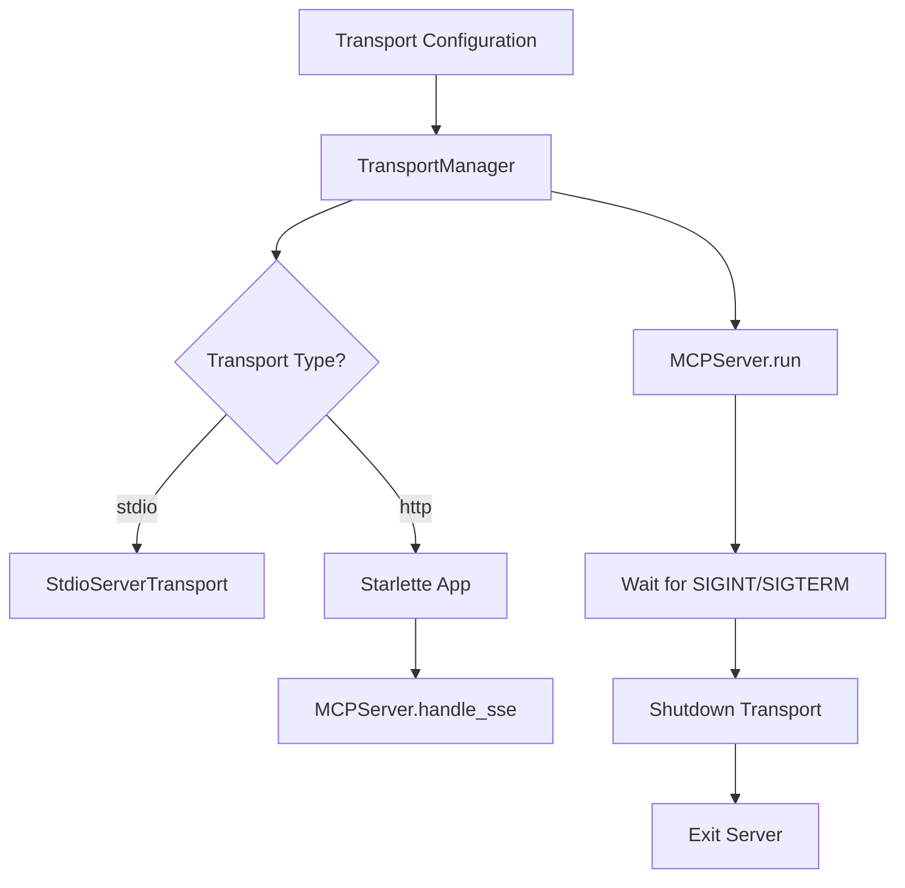

# Transport Manager

> Feature spec for code-forge implementation planning.
> Source: extracted from apcore-mcp/docs/tech-design-apcore-mcp.md
> Created: 2026-04-06

## Purpose

The Transport Manager handles the configuration and execution of the communication layer between the MCP client and the apcore-mcp server. It abstracts the differences between standard input/output (stdio), local network (SSE/HTTP), and cloud-hosted transports, allowing the same MCP logic to run in any environment.

## Scope

**Included:**
- Setup and execution of `stdio` transport (stdin/stdout).
- Setup and execution of `streamable-http` transport (Starlette/FastAPI-based).
- Support for deprecated `SSE` (Server-Sent Events) transport for backward compatibility.
- Configuration of host, port, and network bind addresses.
- Management of server lifecycle (startup, blocking wait, graceful shutdown).
- Routing of transport events (e.g., connection lost) to the server.

**Excluded:**
- Implementation of the protocol messages (handled by MCP SDK).
- Encryption or SSL termination (typically handled by a reverse proxy or the host application).

## Core Responsibilities

1. **Transport Factory** — Creates the appropriate transport instance (stdio, HTTP, SSE) based on user configuration.
2. **Server Lifecycle** — Provides a high-level `run()` method that starts the server, binds it to the transport, and blocks until shutdown signals are received.
3. **Graceful Shutdown** — Handles SIGINT and SIGTERM signals to ensure the server shuts down and closes connections cleanly without data loss or leaking processes.
4. **Environment Bridge** — Normalizes differences between synchronous stdio (process-bound) and asynchronous HTTP (network-bound) environments.

## Interfaces

### Inputs
- **Transport Type** (CLI/Public API) — Choice of `stdio`, `streamable-http`, or `sse`.
- **Host/Port** (Public API) — Bind configuration for network transports.
- **MCP Server Instance** (MCPServerFactory) — The configured logic instance to bind to.

### Outputs
- **Transport Instance** (MCP SDK) — The low-level transport object used by the MCP SDK.
- **Server Process** (OS) — The running server listening for client messages.

### Dependencies
- **MCP Python SDK** — Provides the `StdioServerTransport` and `HttpServerTransport` base classes.
- **Starlette / Uvicorn** — Used for hosting HTTP and SSE transports.

## Data Flow

## Key Behaviors

### stdio (Process-Bound)
The transport manager configures the server to read from `sys.stdin` and write to `sys.stdout`. It monitors the stdin pipe and initiates shutdown if the parent process (the MCP client) closes the pipe or terminates.

### Streamable HTTP (Network-Bound)
The transport manager constructs a Starlette ASGI application that hosts the MCP protocol. It mounts the necessary routes (e.g., `/sse`, `/messages`) and manages the Uvicorn event loop to handle concurrent client connections.

### SIGINT/SIGTERM Handling
The manager installs signal handlers that trigger an internal shutdown event. This ensures that even in a blocking `run()` call, the server can exit gracefully when a Ctrl+C or a container stop signal is received.

## Constraints

- **Port Conflict**: Must handle and report "Address already in use" errors gracefully.
- **stdio Restrictions**: While using stdio, the manager must prevent any other library (like `logging` or print statements) from writing to `stdout`, as this would corrupt the MCP protocol stream.
- **Language Runtime Version**: Network transports require an async-capable runtime in each language:
  - Python: ≥ 3.11
  - TypeScript: Node ≥ 18
  - Rust: ≥ 1.75 with Tokio runtime

## Error Handling

- **Bind Failure**: Raises `OSError` if the requested port cannot be bound.
- **Transport Error**: Catches and logs transport-level errors (e.g., malformed HTTP headers) without crashing the server process.

## Notes

- `streamable-http` is the modern, recommended network transport, replacing the legacy `sse` transport.
- For embedded use (e.g., within a larger FastAPI app), the manager yields an ASGI app rather than running its own Uvicorn instance.
- **Cancellation Forwarding:** Rust: `set_cancel_handler` / `notify_cancel` (since 0.13.0). Python (post-TM-4 fix in 0.14.0): `set_async_task_bridge` + `transport_session_var` ContextVar — auto-wired by `serve()`/`async_serve()`. TypeScript: `setAsyncTaskBridge` (analogous wiring). The cross-SDK `ExecutionRouter.cancel(call_id, reason)` dispatcher remains a 0.15.0 roadmap item — see Execution Router "Cancellation Handling" section.

---

## Contract: TransportManager.run_stdio

### Inputs
- server: Server, required — configured MCP Server instance from MCPServerFactory
- init_options: InitializationOptions, required — server identity and capabilities

### Errors
- IOError — when stdin/stdout is not available or pipe breaks
- No explicit bind errors (stdio is process-bound)

### Returns
- On success: None — blocks until the stdio connection closes (parent process terminates or closes pipe); in-flight calls are abandoned on close (no cooperative drain)
- Per-language method names: Python `run_stdio`, TypeScript `runStdio`, Rust `run_stdio`. All three SDKs implement this transport.
- Graceful teardown is signal-driven: the method installs SIGINT/SIGTERM handlers internally and returns when a shutdown signal fires or the stdio pipe closes. There is no separate `shutdown()` method — teardown is owned by this `run_*` call's signal-handling lifecycle.

### Properties
- async: true
- thread_safe: false
- pure: false
- idempotent: false
- handles_sigterm: true

---

## Contract: TransportManager.run_streamable_http

### Inputs
- server: Server, required — configured MCP Server instance
- init_options: InitializationOptions, required
- host: str, optional, default="127.0.0.1" — bind address; must be non-empty
- port: int, optional, default=8000, validates[1–65535], reject_with=ValueError
- extra_routes: list[Route|Mount] | None, optional — additional Starlette routes
- middleware: list[tuple[type, dict]] | None, optional — ASGI middleware stack

### Errors
- ValueError — when host is empty or port is outside 1–65535
- OSError — when port is already in use (Address already in use)
- Transport-level errors (malformed HTTP headers) are caught and logged without crashing

### Returns
- On success: None — blocks until SIGINT or SIGTERM; available in all three SDKs (Python, TypeScript, Rust).
- Per-language method names: Python `run_streamable_http`, TypeScript `runStreamableHttp`, Rust `run_streamable_http`.
- A companion async-context-manager builder is also exposed for embedding inside an existing ASGI app: Python `build_streamable_http_app(server, init_options, extra_routes, middleware)`, TypeScript `buildStreamableHttpApp(...)`, Rust `build_streamable_http_app(...)`. The builder yields the ASGI/Router app without binding a port; the caller hosts it in their own runtime.
- Graceful teardown is signal-driven: SIGINT/SIGTERM handlers installed inside this method initiate the orderly shutdown path. There is no separate `shutdown()` method.

### Properties
- async: true
- thread_safe: true
- pure: false
- idempotent: false
- handles_sigterm: true

---

## Contract: TransportManager.run_sse

### Inputs
- server: Server, required — configured MCP Server instance
- init_options: InitializationOptions, required
- host: str, optional, default="127.0.0.1" — bind address; must be non-empty
- port: int, optional, default=8000, validates[1–65535], reject_with=ValueError
- extra_routes: list[Route|Mount] | None, optional — additional Starlette routes
- middleware: list[tuple[type, dict]] | None, optional — ASGI middleware stack

### Errors
- ValueError — when host is empty or port is outside 1–65535
- OSError — when port is already in use (Address already in use)
- Transport-level errors are caught and logged without crashing

### Returns
- On success: None — blocks until SIGINT or SIGTERM; available in all three SDKs.
- Per-language method names: Python `run_sse`, TypeScript `runSse`, Rust `run_sse`.
- A companion async-context-manager builder is also exposed: Python `build_sse_app(server, init_options, extra_routes, middleware)`, TypeScript `buildSseApp(...)`, Rust `build_sse_app(...)`.
- **Status:** Deprecated since 0.13.0 in favor of `run_streamable_http` but still supported for backward compatibility with legacy MCP clients. Will be removed in a future major release; new integrations SHOULD use `run_streamable_http`.
- Graceful teardown is signal-driven: SIGINT/SIGTERM handlers installed inside this method initiate the orderly shutdown path. There is no separate `shutdown()` method.

### Properties
- async: true
- thread_safe: true
- pure: false
- idempotent: false
- handles_sigterm: true

---

## Contract: TransportManager.set_async_task_bridge

TM-4 transport-disconnect cancellation forwarding (0.14.0). Per-language method names: Python `set_async_task_bridge(bridge)`, TypeScript `setAsyncTaskBridge(bridge)`, Rust `set_cancel_handler(handler)` (with companion `notify_cancel(session_id)` since 0.13.0). All three SDKs share the contract below.

The transport scopes a per-connection session id (Python: `transport_session_var` ContextVar; TS: per-request closure; Rust: tokio task-local). When `factory.handle_call_tool` runs, it forwards that session id as `session_key` to `bridge.submit(...)` so async tasks are tagged with the connection that started them. On transport teardown, the manager calls `bridge.cancel_session_tasks(session_id)` to cancel all in-flight async tasks for the disconnecting client. `serve()` / `async_serve()` / `APCoreMCP.serve` / `async_serve` wire this automatically when an `AsyncTaskBridge` is present.

### Inputs
- bridge: AsyncTaskBridge, required, validates[not_null], reject_with=TypeError(code=INVALID_ARG)
  - Python type: `apcore_mcp.adapters.AsyncTaskBridge`
  - TypeScript type: `AsyncTaskBridge` from `apcore-mcp/adapters`
  - Rust equivalent: `Arc<dyn CancelHandler>` accepted by `set_cancel_handler`
- The bridge must implement `cancel_session_tasks(session_id: str) -> None` (or language-equivalent)

### Errors
- TypeError(code=INVALID_ARG) — bridge is None / null / `Option::None`
- No exceptions raised on overwrite — replacing an existing bridge is allowed (idempotent setter); a debug log line is emitted noting the replacement

### Returns
- On success: None / void / `()`
- Side effect: stores the bridge reference on the TransportManager instance; subsequent transport-disconnect events will call `bridge.cancel_session_tasks(session_id)` with the per-connection session id captured at request time

### Properties
- async: false
- thread_safe: true
- pure: false
- idempotent: true
