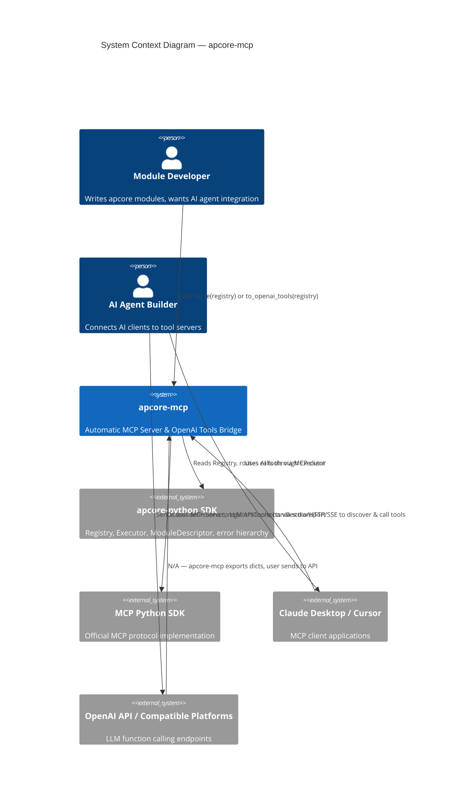
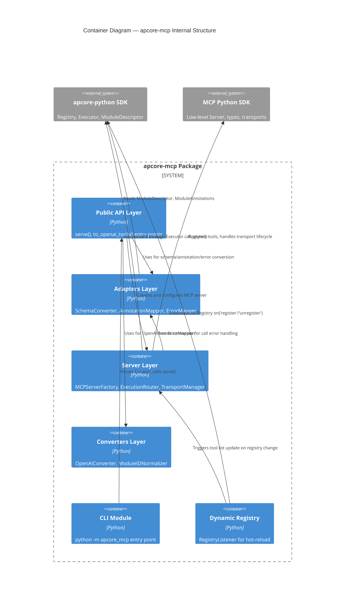
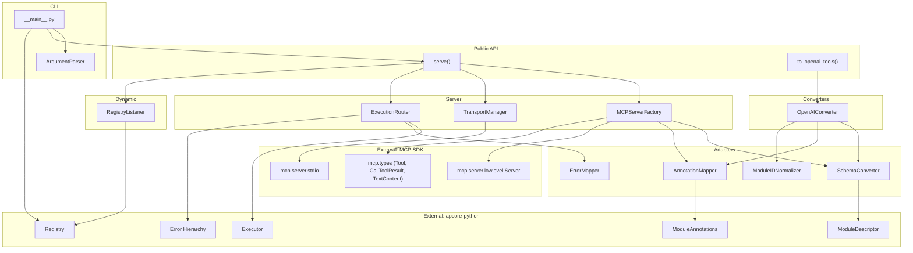
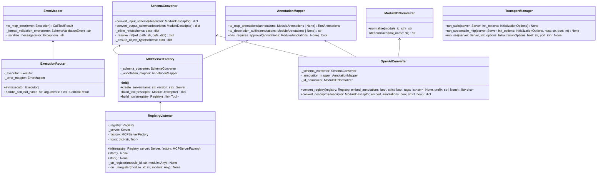
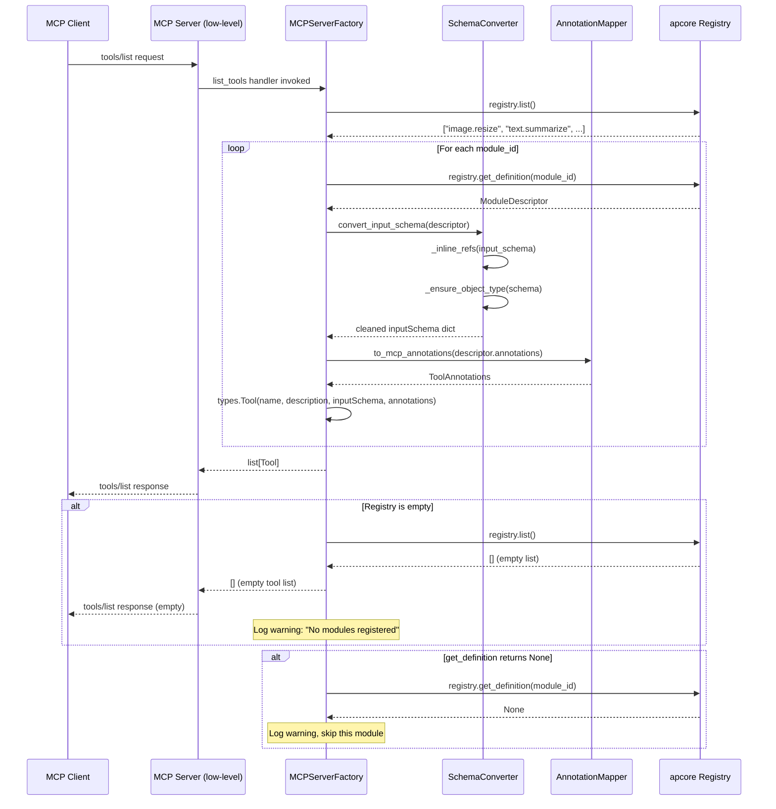
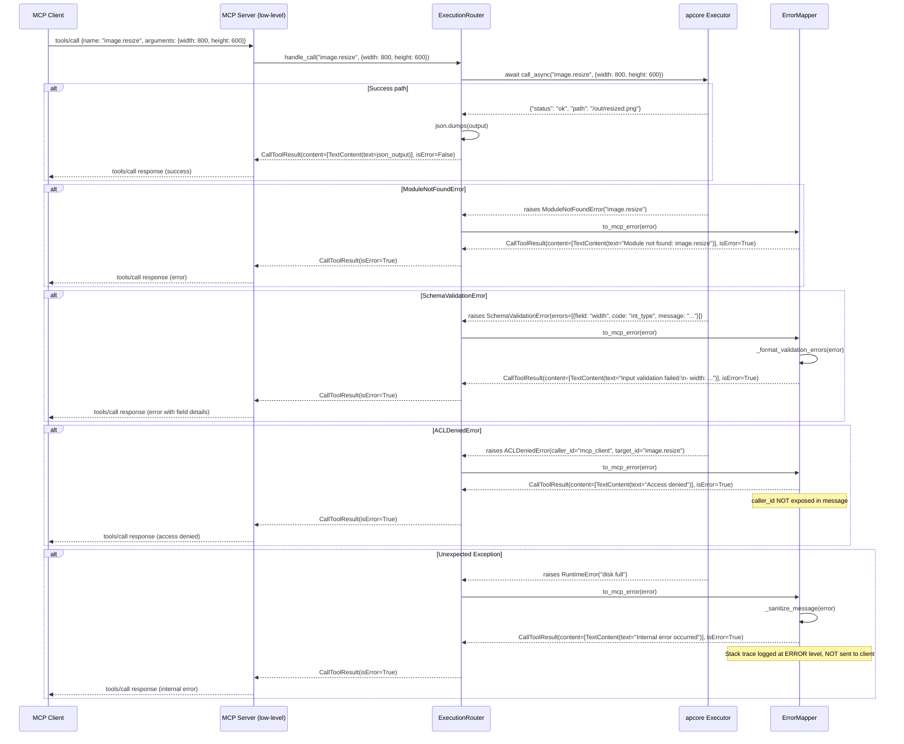
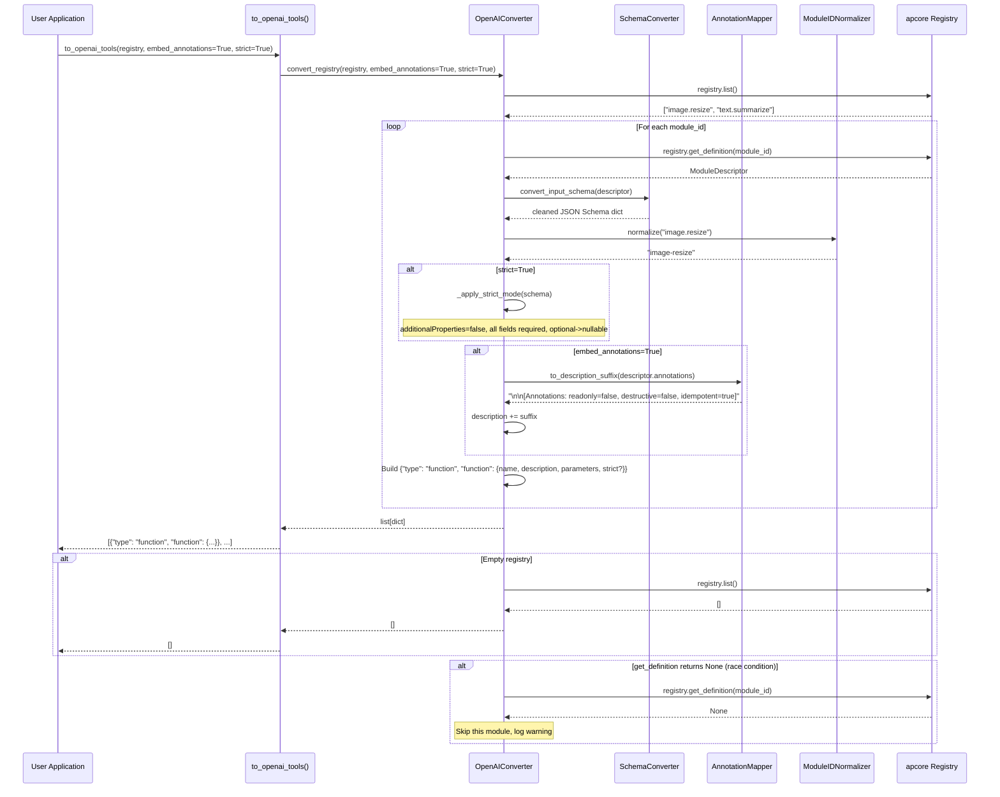
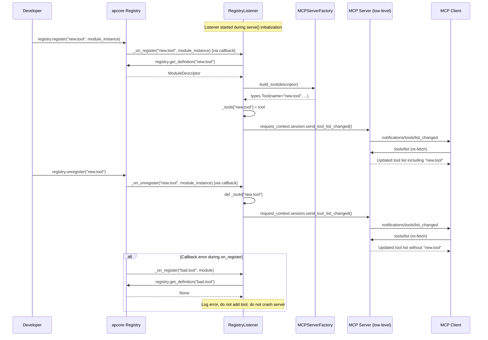

# Technical Design Document: apcore-mcp

| Field       | Value                                                                    |
|-------------|--------------------------------------------------------------------------|
| Title       | apcore-mcp: Automatic MCP Server & OpenAI Tools Bridge                   |
| Version     | 1.0                                                                      |
| Date        | 2026-02-15                                                               |
| Author      | aipartnerup Engineering Team                                             |
| Status      | Draft                                                                    |
| Reviewers   | apcore Core Maintainers, Community Contributors                          |
| PRD Ref     | `docs/prd-apcore-mcp.md` v1.0                                           |
| License     | Apache 2.0                                                               |

---

## 1. Overview & Goals

### 1.1 Problem Statement

apcore modules carry rich, machine-readable metadata -- `input_schema` (JSON Schema via Pydantic), `output_schema`, human-readable `description`, and behavioral `annotations` (`readonly`, `destructive`, `idempotent`, `requires_approval`, `open_world`). This metadata is exactly what AI agent protocols -- MCP and OpenAI Function Calling -- require to define callable tools. However, there is currently no standard way to expose apcore modules to AI systems. A developer who wants their apcore modules available in Claude Desktop via MCP must manually create an MCP Server, hand-write tool definitions for each module (duplicating schemas already expressed in apcore), implement execution routing, and handle error mapping. This process takes approximately 2 hours per module, is error-prone due to schema drift, and leads to ecosystem fragmentation as each `xxx-apcore` project (comfyui-apcore, vnpy-apcore, blender-apcore) builds its own ad-hoc integration. apcore-mcp eliminates this entire class of work by automatically bridging any apcore `Registry` into both a fully functional MCP Server and OpenAI-compatible tool definitions at runtime, with zero per-module code.

### 1.2 Goals

| ID   | Goal                                                                                     |
|------|------------------------------------------------------------------------------------------|
| G-01 | Automatically convert any apcore `Registry` into MCP tool definitions with 100% schema mapping accuracy |
| G-02 | Provide a one-function entry point (`serve()`) to launch a standards-compliant MCP Server |
| G-03 | Provide a pure-function entry point (`to_openai_tools()`) to export OpenAI-compatible tool definitions |
| G-04 | Support all three MCP transports: stdio, Streamable HTTP, SSE                            |
| G-05 | Preserve all apcore behavioral annotations as MCP tool annotations                       |
| G-06 | Route all MCP tool calls through the apcore `Executor` pipeline (ACL, validation, middleware, timeout) |
| G-07 | Map the full apcore error hierarchy to structured MCP error responses                    |
| G-08 | Achieve >= 90% test coverage with TDD methodology                                       |
| G-09 | Keep core logic under 1,200 lines (excluding tests and docs)                             |
| G-10 | Serve as the infrastructure layer for all future `xxx-apcore` projects                   |

### 1.3 Non-Goals

| ID    | Non-Goal                                                                              |
|-------|---------------------------------------------------------------------------------------|
| NG-01 | Reimplement the MCP protocol -- use the official `mcp` Python SDK                     |
| NG-02 | Define modules -- that is apcore-python's responsibility                              |
| NG-03 | Implement domain-specific node/function wrapping -- that is `xxx-apcore` projects' job |
| NG-04 | Build an OpenAI API client or agent runtime                                           |
| NG-05 | Implement A2A (Agent-to-Agent) adapter -- separate future project                     |
| NG-06 | Add authentication/authorization beyond apcore Executor's built-in ACL                |
| NG-07 | Build a full-featured production dashboard (the optional Tool Inspector is a minimal dev debugging UI) |

### 1.4 Key Metrics

| Metric                    | Target       | Measurement Method                              |
|---------------------------|--------------|--------------------------------------------------|
| Schema mapping accuracy   | 100%         | Automated tests: every ModuleDescriptor field verified |
| Tool call overhead        | < 5ms        | Benchmark: time added beyond Executor.call_async() |
| Tool registration time    | < 100ms/100  | Benchmark: 100-module registry schema conversion |
| Memory overhead           | < 10MB/100   | Memory profiling with 100 registered tools       |
| Integration time          | < 5 minutes  | Timed walkthrough from `pip install` to working server |
| Test coverage             | >= 90%       | pytest-cov line coverage on `src/apcore_mcp/`    |
| Core logic size           | 500-1200 LOC | cloc measurement excluding tests                 |

---

## 2. Design Inputs

### 2.1 PRD Summary

The PRD (`docs/prd-apcore-mcp.md` v1.0) defines 25 features across three priority tiers:

- **P0 (9 features, F-001 through F-009):** Core schema mapping, annotation mapping, execution routing, error mapping, `serve()` function, stdio/Streamable HTTP transports, `to_openai_tools()`, CLI entry point.
- **P1 (7 features, F-010 through F-016):** SSE transport, OpenAI annotation embedding, OpenAI strict mode, structured output, Executor passthrough, dynamic tool registration, logging.
- **P2 (9 features, F-017 through F-025):** Filtering for `to_openai_tools()` and `serve()`, health check endpoint, MCP resource exposure, Prometheus metrics endpoint, metrics collector parameter, input validation parameter, streaming and progress support, MCPServer background wrapper.

### 2.2 Design-to-PRD Traceability Matrix

| Design Component             | PRD Features                | Priority |
|------------------------------|-----------------------------|----------|
| Schema Converter             | F-001, F-005, F-008         | P0       |
| Annotation Mapper            | F-002, F-011                | P0, P1   |
| Execution Router             | F-003, F-014                | P0, P1   |
| Error Mapper                 | F-004                       | P0       |
| MCP Server Factory           | F-005, F-006, F-007, F-010  | P0, P1   |
| OpenAI Converter             | F-008, F-011, F-012, F-017  | P0, P1, P2 |
| Transport Manager            | F-006, F-007, F-010         | P0, P1   |
| CLI Module                   | F-009                       | P0       |
| Dynamic Registry Listener    | F-015                       | P1       |
| Structured Output Handler    | F-013                       | P1       |
| Logging & Observability      | F-016                       | P1       |
| Module Filtering             | F-017, F-018                | P2       |
| Health Check                 | F-019                       | P2       |
| MCP Resource Exposure        | F-020                       | P2       |
| Metrics Exporter             | F-021, F-022                | P2       |
| Input Validator              | F-023                       | P2       |
| Streaming & Progress         | F-024                       | P2       |
| MCPServer Background Wrapper | F-025                       | P2       |
| MCP Tool Inspector           | F-026                       | P2       |

### 2.3 Key Constraints from User Requirements

1. **Architecture:** Layered module structure (`src/apcore_mcp/{adapters,server,cli,converters}/`) -- extensible for future `xxx-apcore` projects.
2. **Async strategy:** Async-first internally; sync modules bridged via `asyncio.to_thread()` (leveraging `Executor.call_async()` which already handles this).
3. **Testing:** TDD strict mode with comprehensive coverage -- this is a foundation project.
4. **Auth/ACL:** Rely entirely on apcore `Executor`'s built-in ACL. No custom auth layer.
5. **Quality bar:** High -- all future `xxx-apcore` projects depend on this infrastructure.

---

## 3. Architecture Overview

### 3.1 C4 Context Diagram



### 3.2 C4 Container Diagram



### 3.3 Component Diagram



### 3.4 Architecture Decision Records

#### ADR-01: Use MCP Low-Level Server, Not MCPServer (formerly FastMCP)

**Context:** The MCP Python SDK offers two server APIs: the high-level `MCPServer` class (decorator-based, auto-generates schemas from type hints) and the low-level `mcp.server.lowlevel.Server` class (handler-based, explicit `types.Tool` registration).

**Decision:** Use the low-level `Server` API.

**Rationale:**
- apcore-mcp registers tools dynamically at runtime from a Registry, not via decorators on static functions.
- The low-level API gives direct control over `types.Tool` objects, allowing us to set `inputSchema`, `annotations`, and `outputSchema` from apcore metadata.
- The `@server.list_tools()` and `@server.call_tool()` handler pattern maps perfectly to our dynamic dispatch model.
- The high-level `MCPServer.tool()` decorator expects a concrete Python function per tool; we have N tools resolved at runtime.

**Consequences:** We must handle tool listing, tool calling, transport lifecycle, and tool list change notifications ourselves. This is acceptable given the thin adapter nature of apcore-mcp.

#### ADR-02: Async-First Execution via Executor.call_async()

**Context:** MCP servers run in an async event loop. apcore modules may be sync or async.

**Decision:** Always use `Executor.call_async()` for tool execution.

**Rationale:** `Executor.call_async()` (verified in source code) natively handles both sync and async modules. For sync modules, it uses `asyncio.to_thread()` to avoid blocking the event loop. For async modules, it calls the coroutine directly. This matches the MCP server's async runtime perfectly.

**Consequences:** No additional bridging code needed in apcore-mcp. The Executor handles all sync/async concerns transparently.

#### ADR-03: Module ID Normalization for OpenAI Compatibility

**Context:** apcore module IDs use dot notation (e.g., `image.resize`, `comfyui.workflow.execute`). OpenAI function names must match `^[a-zA-Z0-9_-]+$` -- dots are not allowed.

**Decision:** Implement a deterministic, reversible normalization function that replaces `.` with `-` (hyphen) for OpenAI export, and provide a reverse function for dispatching.

**Rationale:**
- Single underscore `_` risks collision with IDs that already contain underscores (e.g., `image_resize` vs `image.resize`).
- Hyphen `-` is unambiguous: apcore module IDs do not use hyphens by convention.
- The mapping is bijective (reversible), which is critical if the user needs to dispatch OpenAI tool calls back to the Executor.

**Consequences:** All OpenAI-facing tool names use `-` instead of `.`. The `ModuleIDNormalizer` class provides both `normalize()` and `denormalize()` methods. MCP tool names retain the original dot notation (MCP has no character restrictions on tool names).

#### ADR-04: Schema $ref Inlining for MCP/OpenAI Compatibility

**Context:** Pydantic's `model_json_schema()` may produce schemas with `$defs` and `$ref` references for nested models. Some MCP clients and OpenAI's function calling API may not support `$ref` resolution.

**Decision:** Inline all `$ref` references before passing schemas to MCP or OpenAI, using apcore-python's `RefResolver` algorithm as reference but with a simpler self-contained inliner for `$defs`-local references.

**Rationale:** Pydantic v2's `model_json_schema()` produces `$defs` at the root level with `$ref` pointers like `"$ref": "#/$defs/ModelName"`. These are local references that can be resolved by substitution. External file references (`apcore://` or relative paths) are not generated by Pydantic and are out of scope.

**Consequences:** The `SchemaConverter` includes a `_inline_refs()` method that resolves all `$defs`-local `$ref` nodes. The `$defs` key is removed from the final schema.

---

## 4. Proposed Solution (Solution A -- Recommended)

### 4.1 Layered Architecture

Solution A uses a **layered module architecture** with clear separation of concerns:

```
src/apcore_mcp/
    __init__.py          # Public API: serve(), to_openai_tools()
    __main__.py          # CLI entry point: python -m apcore_mcp
    _types.py            # Internal type definitions and TypeAliases
    adapters/
        __init__.py
        schema.py        # SchemaConverter: apcore schemas -> MCP/OpenAI schemas
        annotations.py   # AnnotationMapper: ModuleAnnotations -> MCP ToolAnnotations
        errors.py        # ErrorMapper: apcore errors -> MCP error responses
        id_normalizer.py # ModuleIDNormalizer: dot-notation <-> hyphen
    server/
        __init__.py
        factory.py       # MCPServerFactory: create and configure MCP Server
        router.py        # ExecutionRouter: MCP tool calls -> Executor
        transport.py     # TransportManager: stdio/HTTP/SSE lifecycle
        listener.py      # RegistryListener: dynamic tool registration
    converters/
        __init__.py
        openai.py        # OpenAIConverter: to_openai_tools() implementation
```

### 4.2 Class Diagram



### 4.3 Sequence Diagrams

#### 4.3.1 MCP Tool Discovery Flow



#### 4.3.2 MCP Tool Execution Flow



#### 4.3.3 OpenAI Tools Export Flow



#### 4.3.4 Dynamic Tool Registration Flow



### 4.4 Package Structure

```
src/apcore_mcp/
    __init__.py              # 30 LOC  - Public API exports
    __main__.py              # 60 LOC  - CLI entry point
    _types.py                # 30 LOC  - Internal types (RegistryOrExecutor union, etc.)
    adapters/
        __init__.py          # 10 LOC  - Re-exports
        schema.py            # 120 LOC - SchemaConverter
        annotations.py       # 60 LOC  - AnnotationMapper
        errors.py            # 100 LOC - ErrorMapper
        id_normalizer.py     # 40 LOC  - ModuleIDNormalizer
    server/
        __init__.py          # 10 LOC  - Re-exports
        factory.py           # 150 LOC - MCPServerFactory
        router.py            # 80 LOC  - ExecutionRouter
        transport.py         # 100 LOC - TransportManager
        listener.py          # 80 LOC  - RegistryListener
    converters/
        __init__.py          # 10 LOC  - Re-exports
        openai.py            # 120 LOC - OpenAIConverter
                             ----------
                             ~1000 LOC total (within 500-1200 target)
```

---

## 5. Alternative Solution (Solution B)

### 5.1 Monolithic Single-Module Architecture

Solution B consolidates all logic into a single Python module file (`apcore_mcp.py`) with a flat function-based API. Instead of a layered architecture with separate adapter, server, and converter packages, all classes are defined in one file and all logic is co-located.

```
src/apcore_mcp/
    __init__.py          # Re-exports from core.py
    __main__.py          # CLI entry point
    core.py              # ALL logic: schema conversion, annotation mapping,
                         # error mapping, execution routing, server factory,
                         # transport management, OpenAI conversion, registry listener
                         # (~800-1000 LOC in a single file)
```

**Design approach:**
- `serve()` and `to_openai_tools()` are top-level functions in `core.py`.
- Helper classes (`_SchemaConverter`, `_AnnotationMapper`, `_ErrorMapper`, etc.) are module-private (underscore-prefixed) classes within `core.py`.
- No sub-packages, no layered imports.

### 5.2 Comparison Matrix

| Dimension          | Solution A (Layered)                              | Solution B (Monolithic)                           |
|--------------------|---------------------------------------------------|---------------------------------------------------|
| **Complexity**     | 14 files across 3 sub-packages; moderate navigation overhead | 3 files total; simple navigation |
| **Extensibility**  | Excellent: xxx-apcore projects can import `adapters.schema.SchemaConverter` directly for custom pipelines | Poor: all internals are private; extending requires forking or monkeypatching |
| **Maintainability**| Each component testable in isolation; changes are localized | Single-file changes risk merge conflicts; hard to assign ownership |
| **Performance**    | Identical at runtime (Python import overhead is negligible) | Identical at runtime |
| **Testing**        | Natural test organization mirrors source structure | Tests must cover one large file; test file grows unwieldy |
| **Onboarding**     | Clear package structure signals intent; new contributors find components quickly | Lower initial friction (fewer files to navigate) but harder to understand boundaries |
| **Future-proofing**| Adding new output formats (A2A, LangChain) is a new file in `converters/` | Adding new formats means the single file grows indefinitely |
| **Dependency injection** | Components accept dependencies via constructor; easy to mock | All coupling is within one file; mocking requires patching module-level classes |

### 5.3 Decision

**Solution A is selected.** The primary reasons:

1. **Extensibility mandate:** The user requirement explicitly states the architecture "needs to be extensible for future xxx-apcore projects." Solution B's private internals prevent downstream reuse.
2. **TDD compatibility:** Solution A's isolated components map cleanly to focused test modules. This supports the "TDD strict mode" requirement.
3. **Foundation project quality bar:** As infrastructure that all future projects depend on, the layered architecture communicates professional engineering standards and invites community contribution.
4. **Marginal complexity cost:** The layered structure adds approximately 10 files of boilerplate (`__init__.py` files). This is trivial overhead compared to the extensibility and maintainability benefits.

---

## 6. Detailed Component Design

### 6.1 Schema Converter

**File:** `src/apcore_mcp/adapters/schema.py`

**Responsibility:** Convert apcore `ModuleDescriptor.input_schema` and `output_schema` (JSON Schema dicts produced by Pydantic `model_json_schema()`) into clean schemas suitable for MCP `inputSchema` and OpenAI `parameters`. The primary task is `$defs`/`$ref` inlining and ensuring the root schema has `type: object`.

**Public API:**

```python
class SchemaConverter:
    """Converts apcore JSON Schema dicts to MCP/OpenAI-compatible schemas."""

    def convert_input_schema(self, descriptor: ModuleDescriptor) -> dict[str, Any]:
        """Convert a ModuleDescriptor's input_schema for MCP/OpenAI consumption.

        Args:
            descriptor: The apcore ModuleDescriptor containing input_schema.

        Returns:
            A JSON Schema dict with all $ref inlined, $defs removed,
            and root type guaranteed to be "object".

        Raises:
            ValueError: If descriptor.input_schema contains circular $ref
                        that cannot be resolved within 32 recursion levels.
        """

    def convert_output_schema(self, descriptor: ModuleDescriptor) -> dict[str, Any]:
        """Convert a ModuleDescriptor's output_schema for structured output.

        Args:
            descriptor: The apcore ModuleDescriptor containing output_schema.

        Returns:
            A JSON Schema dict with all $ref inlined and $defs removed.
            Returns empty dict {} if output_schema is empty.

        Raises:
            ValueError: If descriptor.output_schema contains circular $ref
                        that cannot be resolved within 32 recursion levels.
        """
```

**Internal implementation:**

```python
    def _inline_refs(self, schema: dict[str, Any]) -> dict[str, Any]:
        """Inline all $defs-local $ref references and remove $defs.

        Algorithm:
        1. Extract $defs (or definitions) from root if present.
        2. Walk the schema tree. For each {"$ref": "#/$defs/Name"} node:
           a. Look up the definition in the extracted $defs dict.
           b. Deep-copy the definition.
           c. Recursively resolve any nested $ref within the copy.
           d. Replace the $ref node with the resolved definition.
        3. Remove the $defs key from root.
        4. Track visited refs to detect circular references.

        Args:
            schema: Raw JSON Schema dict (may contain $defs and $ref).

        Returns:
            New dict with all $ref replaced by their definitions.

        Raises:
            ValueError: If circular $ref detected (A -> B -> A).
        """

    def _resolve_ref(
        self,
        ref_path: str,
        defs: dict[str, Any],
        visited: set[str],
        depth: int = 0,
    ) -> dict[str, Any]:
        """Resolve a single $ref path against a $defs dict.

        Args:
            ref_path: JSON Pointer string, e.g. "#/$defs/ImageSize".
            defs: The $defs dictionary from the root schema.
            visited: Set of ref_paths currently being resolved (cycle detection).
            depth: Current recursion depth.

        Returns:
            Deep copy of the resolved definition with nested $ref also resolved.

        Raises:
            ValueError: If ref_path is circular or depth exceeds 32.
            KeyError: If ref_path points to a non-existent definition.
        """

    def _ensure_object_type(self, schema: dict[str, Any]) -> dict[str, Any]:
        """Ensure the root schema has type: object.

        If the schema is empty ({}), returns {"type": "object", "properties": {}}.
        If the schema lacks a "type" key but has "properties", adds "type": "object".

        Args:
            schema: JSON Schema dict.

        Returns:
            Schema dict guaranteed to have "type": "object" at root.
        """
```

**Error handling:**
- Circular `$ref` detected by tracking a `visited` set during recursive resolution. If a ref_path appears twice in the recursion chain, raise `ValueError` with the cycle path.
- Missing `$ref` target (key not in `$defs`): raise `KeyError` with the missing definition name.
- Maximum recursion depth (32 levels) prevents stack overflow on deeply nested schemas.

**Thread/async safety:** `SchemaConverter` is stateless and immutable. All methods are pure functions operating on input data. Safe for concurrent use from multiple async tasks.

---

### 6.2 Annotation Mapper

**File:** `src/apcore_mcp/adapters/annotations.py`

**Responsibility:** Convert apcore `ModuleAnnotations` dataclass to MCP `ToolAnnotations` and optionally generate a description suffix for OpenAI tools.

**Public API:**

```python
from mcp.types import ToolAnnotations

class AnnotationMapper:
    """Maps apcore ModuleAnnotations to MCP ToolAnnotations and OpenAI description suffixes."""

    def to_mcp_annotations(
        self,
        annotations: ModuleAnnotations | None,
    ) -> ToolAnnotations:
        """Convert apcore annotations to MCP ToolAnnotations.

        Mapping:
            annotations.readonly      -> ToolAnnotations(read_only_hint=...)
            annotations.destructive   -> ToolAnnotations(destructive_hint=...)
            annotations.idempotent    -> ToolAnnotations(idempotent_hint=...)
            annotations.open_world    -> ToolAnnotations(open_world_hint=...)

        If annotations is None, returns ToolAnnotations with MCP defaults:
            read_only_hint=False, destructive_hint=False,
            idempotent_hint=False, open_world_hint=True

        Args:
            annotations: apcore ModuleAnnotations instance or None.

        Returns:
            MCP ToolAnnotations instance.
        """

    def to_description_suffix(
        self,
        annotations: ModuleAnnotations | None,
    ) -> str:
        """Generate a parseable annotation suffix for OpenAI tool descriptions.

        Only includes non-default annotation values to keep descriptions concise.

        Args:
            annotations: apcore ModuleAnnotations instance or None.

        Returns:
            Empty string if annotations is None or all values are defaults.
            Otherwise: "\\n\\n[Annotations: readonly=true, destructive=false, ...]"
            Only fields that differ from defaults are included.

        Default values (excluded from output when matching):
            readonly=False, destructive=False, idempotent=False,
            requires_approval=False, open_world=True
        """

    def has_requires_approval(
        self,
        annotations: ModuleAnnotations | None,
    ) -> bool:
        """Check if the module requires approval before execution.

        Args:
            annotations: apcore ModuleAnnotations instance or None.

        Returns:
            True if annotations is not None and annotations.requires_approval is True.
            False otherwise.
        """
```

**Error handling:** No exceptions are raised. All methods handle `None` input gracefully by returning safe defaults.

**Thread/async safety:** Stateless and immutable. All methods are pure functions.

---

### 6.3 Execution Router

**File:** `src/apcore_mcp/server/router.py`

**Responsibility:** Receive MCP tool call requests (tool name + arguments dict) and route them through `Executor.call_async()`. Convert the result to a `CallToolResult` or map errors via `ErrorMapper`.

**Public API:**

```python
from mcp.types import CallToolResult

class ExecutionRouter:
    """Routes MCP tool calls through the apcore Executor pipeline."""

    def __init__(self, executor: Executor) -> None:
        """Initialize the router with an Executor instance.

        Args:
            executor: Pre-configured apcore Executor instance.
                      Must have a valid Registry attached.

        Raises:
            TypeError: If executor is not an instance of apcore.Executor.
        """

    async def handle_call(
        self,
        tool_name: str,
        arguments: dict[str, Any],
    ) -> CallToolResult:
        """Execute a tool call through the Executor pipeline.

        Steps:
        1. Call executor.call_async(tool_name, arguments).
        2. On success: serialize output dict to JSON string,
           return CallToolResult with TextContent and isError=False.
        3. On apcore error: delegate to ErrorMapper.to_mcp_error().
        4. On unexpected exception: log full traceback at ERROR level,
           return sanitized "Internal error occurred" via ErrorMapper.

        Args:
            tool_name: The MCP tool name (equals apcore module_id).
            arguments: The tool arguments dict from the MCP client.
                       May be empty dict {} for modules with no required inputs.

        Returns:
            CallToolResult with either success content or error content.
            Never raises -- all errors are caught and converted to CallToolResult.
        """
```

**Internal implementation:**

```python
    async def _execute(
        self,
        tool_name: str,
        arguments: dict[str, Any],
    ) -> dict[str, Any]:
        """Call executor.call_async() and return the raw output dict.

        Args:
            tool_name: apcore module_id.
            arguments: Input arguments dict.

        Returns:
            Module output dict.

        Raises:
            Any apcore error (ModuleNotFoundError, SchemaValidationError, etc.)
            or unexpected Exception.
        """

    def _serialize_output(self, output: dict[str, Any]) -> str:
        """Serialize module output dict to a JSON string.

        Uses json.dumps with default=str to handle non-serializable types
        (datetime, Path, UUID) gracefully.

        Args:
            output: Module output dict.

        Returns:
            JSON string representation.
        """
```

**Error handling:** `handle_call()` wraps the entire execution in a try/except. It catches `ModuleError` (the base class for all apcore errors) and any `Exception`. All errors are converted to `CallToolResult` with `isError=True`. No exception ever propagates to the MCP Server layer. Unexpected exceptions are logged with full traceback at ERROR level via the `apcore_mcp.server.router` logger, but the error message sent to the MCP client is always the generic "Internal error occurred" to prevent information leakage.

**Thread/async safety:** `handle_call()` is an async method. It delegates to `Executor.call_async()` which internally handles sync/async module bridging. Multiple concurrent tool calls are safe because each `call_async()` invocation creates its own `Context` with an independent call chain. The `Executor` is thread-safe (verified in source: uses `threading.RLock` for cache, `threading.Thread` for timeout enforcement).

---

### 6.4 Error Mapper

**File:** `src/apcore_mcp/adapters/errors.py`

**Responsibility:** Convert apcore error hierarchy instances into MCP `CallToolResult` responses with `isError=True` and structured error messages.

**Public API:**

```python
from mcp.types import CallToolResult, TextContent
import logging

logger = logging.getLogger("apcore_mcp.adapters.errors")

class ErrorMapper:
    """Maps apcore errors to MCP CallToolResult error responses."""

    def to_mcp_error(self, error: Exception) -> CallToolResult:
        """Convert any exception to an MCP error CallToolResult.

        Mapping table:
        +---------------------------------+--------------------------------------------+
        | apcore Error                    | MCP Error Message Format                   |
        +---------------------------------+--------------------------------------------+
        | ModuleNotFoundError             | "Module not found: {module_id}"            |
        | SchemaValidationError           | "Input validation failed:\\n- {field}: {msg}"|
        | ACLDeniedError                  | "Access denied"                            |
        | ModuleTimeoutError              | "Module timed out after {timeout_ms}ms"    |
        | InvalidInputError               | "Invalid input: {message}"                 |
        | CallDepthExceededError          | "Call depth limit exceeded"                |
        | CircularCallError               | "Circular call detected"                   |
        | CallFrequencyExceededError      | "Call frequency limit exceeded"            |
        | Any other ModuleError           | "Module error: {error.code}"               |
        | Any non-ModuleError Exception   | "Internal error occurred"                  |
        +---------------------------------+--------------------------------------------+

        For non-ModuleError exceptions, the full exception is logged at ERROR
        level but NOT included in the response to prevent information leakage.

        Args:
            error: The caught exception.

        Returns:
            CallToolResult with isError=True and a TextContent message.
        """
```

**Internal implementation:**

```python
    def _format_validation_errors(self, error: SchemaValidationError) -> str:
        """Format SchemaValidationError field-level details into a human-readable string.

        Format:
            "Input validation failed:
            - field_name: error message (error_code)
            - other_field: other message (other_code)"

        Args:
            error: SchemaValidationError with details["errors"] list.
                   Each error dict has keys: "field", "code", "message".

        Returns:
            Formatted multi-line string.
        """

    def _sanitize_message(self, error: Exception) -> str:
        """Return a safe error message that does not leak internal details.

        For ModuleError subclasses: returns the error.message (which is
        already designed to be user-facing).
        For all other exceptions: returns "Internal error occurred".

        Also logs the full exception at ERROR level for debugging.

        Args:
            error: Any exception.

        Returns:
            Sanitized error message string.
        """

    def _make_error_result(self, message: str) -> CallToolResult:
        """Construct a CallToolResult with isError=True.

        Args:
            message: Error message string.

        Returns:
            CallToolResult(
                content=[TextContent(type="text", text=message)],
                isError=True,
            )
        """
```

**Error handling:** The ErrorMapper itself never raises exceptions. If the error object has unexpected structure (e.g., `SchemaValidationError` without `details["errors"]`), it falls back to the generic `error.message` string. If even that fails, it returns "Internal error occurred".

**Thread/async safety:** Stateless. All methods are synchronous pure functions (no I/O, no shared state). Safe for concurrent use.

---

### 6.5 MCP Server Factory

**File:** `src/apcore_mcp/server/factory.py`

**Responsibility:** Create and configure an MCP `Server` (low-level API) instance with tool handlers. Build `types.Tool` objects from `ModuleDescriptor` instances.

**Public API:**

```python
from mcp.server.lowlevel import Server
from mcp.types import Tool

class MCPServerFactory:
    """Creates and configures MCP Server instances from apcore Registry."""

    def __init__(self) -> None:
        """Initialize with internal SchemaConverter and AnnotationMapper."""

    def create_server(
        self,
        name: str = "apcore-mcp",
        version: str = "0.1.0",
    ) -> Server:
        """Create a new MCP low-level Server instance.

        Args:
            name: Server name reported to MCP clients.
                  Type: str. Default: "apcore-mcp".
                  Constraints: non-empty, max 255 chars.
            version: Server version string.
                  Type: str. Default: "0.1.0".
                  Constraints: non-empty, should follow semver.

        Returns:
            Configured mcp.server.lowlevel.Server instance.
            Tool handlers are NOT registered yet -- call register_handlers()
            after creating the server.

        Raises:
            ValueError: If name is empty or exceeds 255 characters.
            ValueError: If version is empty.
        """

    def build_tool(self, descriptor: ModuleDescriptor) -> Tool:
        """Build an MCP Tool object from an apcore ModuleDescriptor.

        Mapping:
            descriptor.module_id       -> Tool.name
            descriptor.description     -> Tool.description
            descriptor.input_schema    -> Tool.inputSchema (after $ref inlining)
            descriptor.output_schema   -> Tool.outputSchema (after $ref inlining)
            descriptor.annotations     -> Tool.annotations (via AnnotationMapper)

        Args:
            descriptor: apcore ModuleDescriptor with module metadata.

        Returns:
            mcp.types.Tool instance ready for registration.

        Raises:
            ValueError: If descriptor.module_id is empty.
            ValueError: If SchemaConverter encounters circular $ref.
        """

    def build_tools(
        self,
        registry: Registry,
        tags: list[str] | None = None,
        prefix: str | None = None,
    ) -> list[Tool]:
        """Build Tool objects for all modules in a Registry.

        Args:
            registry: apcore Registry instance.
            tags: Optional tag filter (only modules with all specified tags).
                  Type: list[str] | None. Default: None (no filtering).
            prefix: Optional module_id prefix filter.
                  Type: str | None. Default: None (no filtering).

        Returns:
            List of mcp.types.Tool instances.
            Empty list if registry has no modules (with warning logged).

        Raises:
            ValueError: If any individual tool build fails (logged and skipped).
        """

    def register_handlers(
        self,
        server: Server,
        tools: list[Tool],
        router: ExecutionRouter,
    ) -> None:
        """Register list_tools and call_tool handlers on the Server.

        Installs:
        1. @server.list_tools() handler that returns the tools list.
        2. @server.call_tool() handler that delegates to router.handle_call().

        Args:
            server: MCP Server instance (from create_server()).
            tools: List of Tool objects (from build_tools()).
            router: ExecutionRouter instance for handling tool calls.
        """
```

**Error handling:**
- `build_tool()` propagates `ValueError` from `SchemaConverter` if `$ref` resolution fails.
- `build_tools()` catches `ValueError` per-module, logs a warning, and skips the failing module. Other modules are still registered. This ensures one malformed module does not prevent the entire server from starting.
- `register_handlers()` does not raise; it installs async handler functions on the server.

**Thread/async safety:** `MCPServerFactory` is instantiated once and shared. `build_tool()` and `build_tools()` are stateless pure functions. `register_handlers()` modifies the `Server` object but is called once during initialization before the server starts accepting connections.

---

### 6.6 OpenAI Converter

**File:** `src/apcore_mcp/converters/openai.py`

**Responsibility:** Convert an apcore `Registry` into a list of OpenAI-compatible tool definition dicts. Handles module ID normalization, optional annotation embedding, and optional strict mode.

**Public API:**

```python
class OpenAIConverter:
    """Converts apcore Registry modules to OpenAI-compatible tool definitions."""

    def __init__(self) -> None:
        """Initialize with internal SchemaConverter, AnnotationMapper, and ModuleIDNormalizer."""

    def convert_registry(
        self,
        registry: Registry,
        embed_annotations: bool = False,
        strict: bool = False,
        tags: list[str] | None = None,
        prefix: str | None = None,
    ) -> list[dict[str, Any]]:
        """Convert all modules in a Registry to OpenAI tool definitions.

        Args:
            registry: apcore Registry instance.
            embed_annotations: If True, append annotation metadata to each
                tool's description string in parseable format.
                Type: bool. Default: False.
            strict: If True, add "strict": true to each function definition
                and convert schemas to strict mode (additionalProperties=false,
                all properties required, optional fields become nullable).
                Type: bool. Default: False.
            tags: Optional tag filter.
                Type: list[str] | None. Default: None.
            prefix: Optional module_id prefix filter.
                Type: str | None. Default: None.

        Returns:
            List of dicts, each with structure:
            {
                "type": "function",
                "function": {
                    "name": "<normalized_module_id>",
                    "description": "<description>",
                    "parameters": {<JSON Schema>},
                    "strict": true  # only if strict=True
                }
            }
            Empty list [] if registry has no modules.
        """

    def convert_descriptor(
        self,
        descriptor: ModuleDescriptor,
        embed_annotations: bool = False,
        strict: bool = False,
    ) -> dict[str, Any]:
        """Convert a single ModuleDescriptor to an OpenAI tool definition.

        Args:
            descriptor: apcore ModuleDescriptor.
            embed_annotations: Whether to embed annotations in description.
                Type: bool. Default: False.
            strict: Whether to apply strict mode to the schema.
                Type: bool. Default: False.

        Returns:
            Dict with OpenAI tool definition structure.

        Raises:
            ValueError: If descriptor.module_id is empty.
        """
```

**Internal implementation:**

```python
    def _apply_strict_mode(self, schema: dict[str, Any]) -> dict[str, Any]:
        """Convert a JSON Schema to OpenAI strict mode format.

        Rules applied (matching apcore's schema.strict.to_strict_schema):
        1. Set additionalProperties: false on all object types.
        2. Make all properties required.
        3. Optional properties become nullable (type: [original, "null"]).
        4. Strip x-* extension fields.
        5. Remove default values.
        6. Recurse into nested objects, arrays, oneOf/anyOf/allOf.

        Args:
            schema: JSON Schema dict (already $ref-inlined).

        Returns:
            New dict with strict mode rules applied.
        """
```

**Error handling:**
- `convert_registry()` catches exceptions per-module (from `convert_descriptor()`) and logs warnings. Failing modules are skipped.
- `convert_descriptor()` raises `ValueError` if `module_id` is empty.
- Schema conversion errors from `SchemaConverter` are propagated.

**Thread/async safety:** Stateless, all methods are synchronous pure functions. Safe for concurrent use.

---

### 6.7 Transport Manager

**File:** `src/apcore_mcp/server/transport.py`

**Responsibility:** Manage the lifecycle of MCP transport connections (stdio, Streamable HTTP, SSE).

**Public API:**

```python
class TransportManager:
    """Manages MCP server transport lifecycle."""

    async def run_stdio(
        self,
        server: Server,
        init_options: InitializationOptions,
    ) -> None:
        """Start the MCP server with stdio transport.

        Blocks until the parent process terminates the connection.
        Handles graceful shutdown on SIGINT/SIGTERM.

        Args:
            server: Configured MCP Server instance.
            init_options: MCP initialization options (server name, version, capabilities).

        Raises:
            RuntimeError: If stdio streams cannot be opened.
        """

    async def run_streamable_http(
        self,
        server: Server,
        init_options: InitializationOptions,
        host: str = "127.0.0.1",
        port: int = 8000,
    ) -> None:
        """Start the MCP server with Streamable HTTP transport.

        Blocks until the server is shut down.

        Args:
            server: Configured MCP Server instance.
            init_options: MCP initialization options.
            host: Bind address.
                  Type: str. Default: "127.0.0.1".
                  Constraints: valid IPv4/IPv6 address or hostname.
                  Boundary: "0.0.0.0" binds to all interfaces.
            port: Bind port.
                  Type: int. Default: 8000.
                  Range: 1-65535.
                  Boundary: ports < 1024 require root on Unix.

        Raises:
            ValueError: If port is outside range 1-65535.
            ValueError: If host is empty.
            OSError: If the port is already in use.
        """

    async def run_sse(
        self,
        server: Server,
        init_options: InitializationOptions,
        host: str = "127.0.0.1",
        port: int = 8000,
    ) -> None:
        """Start the MCP server with SSE transport (deprecated).

        SSE transport is provided for backward compatibility with older
        MCP clients. New deployments should use Streamable HTTP.

        Args:
            server: Configured MCP Server instance.
            init_options: MCP initialization options.
            host: Bind address. Type: str. Default: "127.0.0.1".
            port: Bind port. Type: int. Default: 8000. Range: 1-65535.

        Raises:
            ValueError: If port is outside range 1-65535.
            ValueError: If host is empty.
            OSError: If the port is already in use.
            DeprecationWarning: Logged at WARNING level on startup.
        """
```

**Internal implementation:**

```python
    def _build_init_options(
        self,
        server: Server,
        name: str,
        version: str,
    ) -> InitializationOptions:
        """Build MCP InitializationOptions with server capabilities.

        Enables:
        - Tool list changed notifications
        - Experimental capabilities: none

        Args:
            server: MCP Server instance (for get_capabilities()).
            name: Server name string.
            version: Server version string.

        Returns:
            InitializationOptions instance.
        """

    def _validate_host_port(self, host: str, port: int) -> None:
        """Validate host and port parameters.

        Args:
            host: Host string to validate.
            port: Port number to validate.

        Raises:
            ValueError: If host is empty string.
            ValueError: If port is not in range 1-65535.
        """
```

**Error handling:**
- Host/port validation performed synchronously before starting the server. Failures raise `ValueError` immediately.
- Transport startup errors (port in use, permission denied) propagate as `OSError` from the underlying transport library.
- Graceful shutdown: stdio transport shuts down when the read stream closes (parent process exit). HTTP/SSE transports respond to `SIGINT`/`SIGTERM`.

**Thread/async safety:** All `run_*` methods are async and block the current event loop. They must be called from the main async context. Only one transport can be active per server instance.

---

### 6.8 CLI Module

**File:** `src/apcore_mcp/__main__.py`

**Responsibility:** Provide a `python -m apcore_mcp` entry point that parses command-line arguments, creates a Registry, discovers modules, and calls `serve()`.

**Public API (CLI interface):**

```
usage: python -m apcore_mcp [OPTIONS]

Launch an apcore-mcp MCP server.

Required:
  --extensions-dir DIR     Path to apcore extensions directory.
                           Must exist and be a readable directory.

Transport options:
  --transport {stdio,streamable-http,sse}
                           MCP transport protocol. Default: stdio.
  --host HOST              Bind address for HTTP/SSE transports.
                           Default: 127.0.0.1.
                           Ignored for stdio transport.
  --port PORT              Bind port for HTTP/SSE transports.
                           Default: 8000. Range: 1-65535.
                           Ignored for stdio transport.

Server options:
  --name NAME              Server name reported to MCP clients.
                           Default: "apcore-mcp". Max 255 chars.
  --version VERSION        Server version string.
                           Default: package version from pyproject.toml.

Logging:
  --log-level {DEBUG,INFO,WARNING,ERROR}
                           Log verbosity level. Default: INFO.

Other:
  --help                   Show this help message and exit.
```

**Internal implementation:**

```python
def main() -> None:
    """CLI entry point. Parses arguments and calls serve().

    Exit codes:
        0 - Normal shutdown (SIGINT/SIGTERM or parent process exit).
        1 - Invalid arguments (non-existent directory, invalid port).
        2 - Startup failure (port in use, permission denied).

    Validation:
        --extensions-dir: Must exist and be a directory. Checked before
            Registry creation. Exit code 1 if invalid.
        --port: Parsed as int, range 1-65535. Exit code 1 if invalid.
        --transport: Must be one of {stdio, streamable-http, sse}.
            argparse handles validation. Exit code 2 if invalid.
        --name: Must be non-empty, max 255 chars. Exit code 1 if invalid.
    """
```

**Error handling:**
- Invalid `--extensions-dir`: prints error message to stderr, exits with code 1.
- Invalid `--port` (not an integer, out of range): prints error message to stderr, exits with code 1.
- Invalid `--transport`: argparse prints error message, exits with code 2.
- No modules discovered: logs warning, starts server with zero tools (as specified in PRD F-009 AC6).
- Startup failure (port in use): logs error, exits with code 2.
- `SIGINT`/`SIGTERM`: graceful shutdown, exits with code 0.

**Thread/async safety:** The CLI module runs in the main thread. It calls `asyncio.run(serve(...))` or equivalent, which creates a new event loop. No threading concerns.

---

### 6.9 Dynamic Registry Listener

**File:** `src/apcore_mcp/server/listener.py`

**Responsibility:** Subscribe to apcore Registry `register`/`unregister` events and update the MCP server's tool list dynamically.

**Public API:**

```python
class RegistryListener:
    """Listens for Registry changes and updates MCP tool list."""

    def __init__(
        self,
        registry: Registry,
        factory: MCPServerFactory,
    ) -> None:
        """Initialize the listener.

        Args:
            registry: apcore Registry to listen to.
            factory: MCPServerFactory for building Tool objects from new modules.

        Raises:
            TypeError: If registry is not a Registry instance.
        """

    @property
    def tools(self) -> dict[str, Tool]:
        """Return a snapshot of currently registered tools.

        Returns:
            Dict mapping module_id -> Tool. Thread-safe snapshot.
        """

    def start(self) -> None:
        """Start listening for Registry events.

        Registers callbacks via registry.on("register", ...) and
        registry.on("unregister", ...).

        Must be called before the MCP server starts serving.
        Safe to call multiple times (idempotent).
        """

    def stop(self) -> None:
        """Stop listening for Registry events.

        Note: apcore Registry does not currently support callback removal.
        This method sets an internal flag that causes callbacks to no-op.
        """
```

**Internal implementation:**

```python
    def _on_register(self, module_id: str, module: Any) -> None:
        """Callback for Registry 'register' event.

        Steps:
        1. Call registry.get_definition(module_id).
        2. If None (race condition), log warning and return.
        3. Call factory.build_tool(descriptor).
        4. Add to internal _tools dict (thread-safe via lock).
        5. Log info: "Tool registered: {module_id}".

        Note: MCP tool list changed notification is sent by the
        list_tools handler which reads from this listener's tools dict.

        Args:
            module_id: The newly registered module ID.
            module: The module instance (not used directly).
        """

    def _on_unregister(self, module_id: str, module: Any) -> None:
        """Callback for Registry 'unregister' event.

        Steps:
        1. Remove module_id from internal _tools dict (thread-safe).
        2. Log info: "Tool unregistered: {module_id}".

        Args:
            module_id: The unregistered module ID.
            module: The module instance (not used).
        """
```

**Error handling:**
- `_on_register()`: if `get_definition()` returns None or `build_tool()` raises, the error is logged and the callback returns without crashing the server.
- `_on_unregister()`: if the module_id is not in the tools dict (already removed), silently ignores.
- All callbacks are wrapped in try/except at the apcore Registry level (verified in source: `_trigger_event()` catches and logs exceptions).

**Thread/async safety:** The internal `_tools` dict is protected by a `threading.Lock`. Registry callbacks are invoked on the thread that calls `registry.register()`/`registry.unregister()`, which may be different from the async event loop thread. The lock ensures thread-safe access to the tools dict. The `list_tools` handler (async, on the event loop) reads from the same dict under the lock.

---

### 6.10 MCPServer Background Wrapper (Python Only)

**Responsibility:** Provide a non-blocking server lifecycle wrapper for embedding an MCP server inside a larger Python application. `MCPServer` wraps `serve()` in a background `threading.Thread`, exposing `start()`, `stop()`, and `wait()` methods.

**Rationale:** The `serve()` function blocks the calling thread (consistent with MCP SDK behavior). In applications that need to run an MCP server alongside other logic (e.g., a GUI, a REST API, or test harnesses), a non-blocking wrapper is necessary. TypeScript does not need an equivalent because `serve()` is already async, and the caller can manage concurrency with standard `Promise`/`async` patterns.

**Public API:**

```python
class MCPServer:
    """Non-blocking MCP server wrapper (Python only).

    Wraps serve() in a background thread with start/stop/wait lifecycle.
    """

    def __init__(
        self,
        registry_or_executor: Registry | Executor,
        **serve_kwargs,
    ) -> None:
        """Store configuration. Does not start the server.

        Args:
            registry_or_executor: Passed through to serve().
            **serve_kwargs: All keyword arguments accepted by serve()
                (transport, host, port, name, version, etc.).
        """

    def start(self) -> None:
        """Start the MCP server in a background daemon thread.

        Returns immediately. The server runs until stop() is called
        or the main process exits.

        If the server is already running, the method silently returns (no-op).
        """

    def stop(self) -> None:
        """Signal the server to shut down gracefully.

        Non-blocking. Use wait() to block until shutdown completes.
        """

    def wait(self) -> None:
        """Block until the server thread has fully stopped."""
```

**Thread/async safety:** The background thread runs its own `asyncio` event loop via `asyncio.run()`. The `stop()` method signals shutdown by scheduling a cancellation on that loop. The `start()`/`stop()`/`wait()` methods are safe to call from any thread.

---

## 7. API Design

### 7.1 `serve()` Function

**File:** `src/apcore_mcp/__init__.py`

```python
def serve(
    registry_or_executor: Registry | Executor,
    *,
    transport: str = "stdio",
    host: str = "127.0.0.1",
    port: int = 8000,
    name: str = "apcore-mcp",
    version: str | None = None,
    tags: list[str] | None = None,
    prefix: str | None = None,
    log_level: str | None = None,
    on_startup: Callable[[], None] | None = None,
    on_shutdown: Callable[[], None] | None = None,
    dynamic: bool = False,
    validate_inputs: bool = False,
    metrics_collector: MetricsExporter | None = None,
) -> None:
    """Launch an MCP Server exposing all apcore modules as tools.

    This is the primary entry point for apcore-mcp. It creates an MCP Server,
    registers all modules from the provided Registry as MCP tools, and starts
    serving using the specified transport. The function blocks until the server
    is shut down.

    Parameters:
        registry_or_executor:
            Type: Registry | Executor
            Required: Yes
            Description: An apcore Registry or Executor instance.
                If a Registry is passed, a default Executor(registry) is created.
                If an Executor is passed, its internal Registry is used for tool
                discovery and the Executor is used for tool call routing.
            Validation: Must be an instance of Registry or Executor.
            Raises TypeError if neither.

        transport:
            Type: str
            Default: "stdio"
            Allowed values: "stdio", "streamable-http", "sse"
            Description: The MCP transport protocol to use.
            Validation: Must be one of the allowed values (case-insensitive,
                normalized to lowercase). Raises ValueError for unknown transport.

        host:
            Type: str
            Default: "127.0.0.1"
            Description: Bind address for HTTP-based transports.
                Ignored when transport="stdio".
            Validation: Must be non-empty. No DNS resolution is performed;
                the value is passed directly to the transport layer.
            Boundary: "0.0.0.0" binds to all network interfaces (use with caution).

        port:
            Type: int
            Default: 8000
            Range: 1-65535
            Description: Bind port for HTTP-based transports.
                Ignored when transport="stdio".
            Validation: Must be an integer in range [1, 65535].
                Raises ValueError if outside range.
            Boundary: Ports below 1024 require elevated privileges on Unix.

        name:
            Type: str
            Default: "apcore-mcp"
            Max length: 255 characters
            Description: Server name reported to MCP clients during initialization.
            Validation: Must be non-empty, max 255 chars.
                Raises ValueError if empty or too long.

        version:
            Type: str | None
            Default: None (uses apcore_mcp.__version__)
            Description: Server version string reported to MCP clients.
            Validation: If provided, must be non-empty.
                Raises ValueError if empty string.

        tags:
            Type: list[str] | None
            Default: None (no filtering -- all modules exposed)
            Description: Only expose modules that have ALL specified tags.
                Uses Registry.list(tags=tags) for filtering.
            Validation: Each tag must be a non-empty string.
                Raises ValueError if any tag is empty.

        prefix:
            Type: str | None
            Default: None (no filtering -- all modules exposed)
            Description: Only expose modules whose module_id starts with this prefix.
                Uses Registry.list(prefix=prefix) for filtering.
            Validation: If provided, must be non-empty.
                Raises ValueError if empty string.

        log_level:
            Type: str | None
            Default: None (no change to logging configuration)
            Allowed values: "DEBUG", "INFO", "WARNING", "ERROR"
            Description: Set the log level via logging.basicConfig(level=...).
            Validation: Must be one of the allowed values (case-insensitive).
                Raises ValueError for unknown level.

    Returns:
        None. This function blocks until the server is shut down.

    Raises:
        TypeError: If registry_or_executor is not a Registry or Executor.
        ValueError: If any parameter fails validation.
        OSError: If the transport port is already in use (HTTP/SSE).

    Examples:
        # Simplest usage -- stdio transport
        serve(registry)

        # HTTP transport with port
        serve(registry, transport="streamable-http", port=9000)

        # Pre-configured Executor with ACL
        serve(executor, transport="streamable-http", host="0.0.0.0", port=8000)

        # Filtered modules
        serve(registry, tags=["public"], prefix="api.")
    """
```

### 7.2 `to_openai_tools()` Function

**File:** `src/apcore_mcp/__init__.py`

```python
def to_openai_tools(
    registry_or_executor: Registry | Executor,
    *,
    embed_annotations: bool = False,
    strict: bool = False,
    tags: list[str] | None = None,
    prefix: str | None = None,
) -> list[dict[str, Any]]:
    """Export apcore Registry modules as OpenAI-compatible tool definitions.

    This is a pure function with no side effects. It reads module metadata
    from the Registry, converts each module to an OpenAI tool definition dict,
    and returns the list. The returned dicts are directly usable with
    openai.chat.completions.create(tools=...).

    Parameters:
        registry_or_executor:
            Type: Registry | Executor
            Required: Yes
            Description: An apcore Registry or Executor instance.
                If an Executor is passed, its .registry property is used.
            Validation: Must be an instance of Registry or Executor.
            Raises TypeError if neither.

        embed_annotations:
            Type: bool
            Default: False
            Description: If True, append apcore annotation metadata to each
                tool's description string in a parseable format:
                "\\n\\n[Annotations: readonly=true, ...]"
                Only non-default values are included.
            Validation: Must be bool. No further validation needed.

        strict:
            Type: bool
            Default: False
            Description: If True, add "strict": true to each function
                definition and convert schemas to OpenAI strict mode:
                - additionalProperties: false on all objects
                - All properties marked as required
                - Optional properties become nullable
                - x-* extensions and defaults stripped
            Validation: Must be bool. No further validation needed.
            Warning: Logged if a schema is incompatible with strict mode
                (e.g., uses additionalProperties: true intentionally).

        tags:
            Type: list[str] | None
            Default: None (no filtering)
            Description: Only include modules that have ALL specified tags.
            Validation: Each tag must be non-empty. Raises ValueError if any empty.

        prefix:
            Type: str | None
            Default: None (no filtering)
            Description: Only include modules whose module_id starts with this prefix.
            Validation: If provided, must be non-empty. Raises ValueError if empty.

    Returns:
        list[dict[str, Any]]: List of OpenAI tool definition dicts.
        Each dict has structure:
        {
            "type": "function",
            "function": {
                "name": "<normalized_module_id>",    # dots replaced with -
                "description": "<description>",
                "parameters": {<JSON Schema>},
                "strict": true                       # only if strict=True
            }
        }
        Empty list [] if the registry has no modules matching the filters.

    Raises:
        TypeError: If registry_or_executor is not a Registry or Executor.
        ValueError: If any parameter fails validation.

    Note:
        This function has NO dependency on the openai package.
        It returns plain Python dicts.

    Examples:
        # Basic export
        tools = to_openai_tools(registry)

        # With annotations and strict mode
        tools = to_openai_tools(registry, embed_annotations=True, strict=True)

        # Filtered
        tools = to_openai_tools(registry, prefix="image.")

        # Usage with OpenAI API
        response = client.chat.completions.create(
            model="gpt-4o",
            messages=[...],
            tools=to_openai_tools(registry),
        )
    """
```

### 7.3 CLI Interface Specification

See section 6.8 for the full CLI specification. Entry points configuration in `pyproject.toml`:

```toml
[project.scripts]
apcore-mcp = "apcore_mcp.__main__:main"
```

This enables both `python -m apcore_mcp` and `apcore-mcp` command invocations.

---

## 8. Data Flow

### 8.1 Module Registration to MCP Tool Creation

```
apcore Registry                     apcore-mcp                              MCP SDK
================                    ==========                              =======

Registry.get_definition(id)
    |
    v
ModuleDescriptor                    SchemaConverter.convert_input_schema()
  .module_id = "image.resize"         |
  .description = "Resize..."          |-- _inline_refs({...$defs...$ref...})
  .input_schema = {                   |-- _ensure_object_type({...})
      "type": "object",               |
      "properties": {...},             v
      "$defs": {...}               Clean JSON Schema dict
  }                                    |
  .output_schema = {...}               |
  .annotations = ModuleAnnotations  AnnotationMapper.to_mcp_annotations()
      .readonly = False                |
      .destructive = False             v
      .idempotent = True           ToolAnnotations(
      .open_world = True               read_only_hint=False,
                                       destructive_hint=False,
                                       idempotent_hint=True,
                                       open_world_hint=True,
                                   )
                                       |
                                       v
                                   types.Tool(                           --> MCP Server
                                       name="image.resize",                 tool list
                                       description="Resize...",
                                       inputSchema={clean schema},
                                       annotations=ToolAnnotations(...),
                                   )
```

### 8.2 MCP Tool Call to apcore Execution to Response

```
MCP Client                    MCP Server           ExecutionRouter         apcore Executor
==========                    ==========           ===============         ===============

tools/call request
  name: "image.resize"
  arguments: {
    "width": 800,
    "height": 600
  }
          |
          v
      call_tool handler
          |
          v
                              router.handle_call(
                                "image.resize",
                                {"width": 800, "height": 600}
                              )
                                        |
                                        v
                                                    executor.call_async(
                                                      "image.resize",
                                                      {"width": 800, "height": 600}
                                                    )
                                                              |
                                                              v
                                                    10-step pipeline:
                                                    1. Context creation
                                                    2. Safety checks
                                                    3. Module lookup
                                                    4. ACL check
                                                    5. Input validation
                                                    6. Middleware before
                                                    7. module.execute()
                                                    8. Output validation
                                                    9. Middleware after
                                                    10. Return output
                                                              |
                                                              v
                                                    {"status": "ok",
                                                     "path": "/out/img.png"}
                                        |
                                        v
                              json.dumps(output)
                                        |
                                        v
CallToolResult(
  content=[TextContent(
    type="text",
    text='{"status":"ok","path":"/out/img.png"}'
  )],
  isError=False,
)
          |
          v
tools/call response
```

### 8.3 Schema Transformation Examples

#### Example 1: Simple schema (no $ref)

**apcore `input_schema` (from Pydantic `model_json_schema()`):**

```json
{
  "type": "object",
  "title": "ImageResizeInput",
  "properties": {
    "width": {"type": "integer", "description": "Target width in pixels"},
    "height": {"type": "integer", "description": "Target height in pixels"},
    "format": {"type": "string", "default": "png", "enum": ["png", "jpg", "webp"]}
  },
  "required": ["width", "height"]
}
```

**MCP `inputSchema` (output of SchemaConverter):**

```json
{
  "type": "object",
  "title": "ImageResizeInput",
  "properties": {
    "width": {"type": "integer", "description": "Target width in pixels"},
    "height": {"type": "integer", "description": "Target height in pixels"},
    "format": {"type": "string", "default": "png", "enum": ["png", "jpg", "webp"]}
  },
  "required": ["width", "height"]
}
```

No transformation needed -- the schema has no `$ref` nodes.

**OpenAI `parameters` (with `strict=True`):**

```json
{
  "type": "object",
  "properties": {
    "width": {"type": "integer", "description": "Target width in pixels"},
    "height": {"type": "integer", "description": "Target height in pixels"},
    "format": {"type": ["string", "null"], "enum": ["png", "jpg", "webp", null]}
  },
  "required": ["format", "height", "width"],
  "additionalProperties": false
}
```

Changes: `default` removed, `format` made required + nullable, `additionalProperties: false` added, `title` stripped.

#### Example 2: Nested schema with $defs/$ref

**apcore `input_schema`:**

```json
{
  "type": "object",
  "title": "WorkflowInput",
  "properties": {
    "workflow_name": {"type": "string"},
    "parameters": {"$ref": "#/$defs/WorkflowParams"}
  },
  "required": ["workflow_name", "parameters"],
  "$defs": {
    "WorkflowParams": {
      "type": "object",
      "properties": {
        "seed": {"type": "integer", "default": 42},
        "steps": {"type": "integer", "default": 20}
      }
    }
  }
}
```

**MCP `inputSchema` (after $ref inlining):**

```json
{
  "type": "object",
  "title": "WorkflowInput",
  "properties": {
    "workflow_name": {"type": "string"},
    "parameters": {
      "type": "object",
      "properties": {
        "seed": {"type": "integer", "default": 42},
        "steps": {"type": "integer", "default": 20}
      }
    }
  },
  "required": ["workflow_name", "parameters"]
}
```

`$defs` removed, `$ref` replaced with the inlined definition.

#### Example 3: Empty input_schema

**apcore `input_schema`:** `{}`

**MCP `inputSchema`:**

```json
{
  "type": "object",
  "properties": {}
}
```

Ensures MCP clients always receive a valid object schema.

---

## 9. Error Handling Strategy

### 9.1 Complete Error Mapping Table

| apcore Error Class            | Error Code (from source)       | MCP isError | MCP Message Format                                   | Details Included                                      |
|-------------------------------|-------------------------------|:-----------:|------------------------------------------------------|-------------------------------------------------------|
| `ModuleNotFoundError`         | `MODULE_NOT_FOUND`            | True        | `"Module not found: {module_id}"`                    | module_id                                             |
| `SchemaValidationError`       | `SCHEMA_VALIDATION_ERROR`     | True        | `"Input validation failed:\n- {field}: {msg} ({code})"` | Field-level errors: field name, message, error code   |
| `ACLDeniedError`              | `ACL_DENIED`                  | True        | `"Access denied"`                                    | None (caller_id NOT exposed for security)             |
| `ModuleTimeoutError`          | `MODULE_TIMEOUT`              | True        | `"Module timed out after {timeout_ms}ms"`            | module_id, timeout_ms                                 |
| `InvalidInputError`           | `GENERAL_INVALID_INPUT`       | True        | `"Invalid input: {message}"`                         | Original error message                                |
| `CallDepthExceededError`      | `CALL_DEPTH_EXCEEDED`         | True        | `"Call depth limit exceeded"`                        | None (call chain NOT exposed)                         |
| `CircularCallError`           | `CIRCULAR_CALL`               | True        | `"Circular call detected"`                           | None (call chain NOT exposed)                         |
| `CallFrequencyExceededError`  | `CALL_FREQUENCY_EXCEEDED`     | True        | `"Call frequency limit exceeded"`                    | None (internal safety detail NOT exposed)             |
| Any other `ModuleError`       | `{error.code}`                | True        | `"Module error: {error.code}"`                       | error.code only                                       |
| Any non-`ModuleError` `Exception` | N/A                       | True        | `"Internal error occurred"`                          | None (full traceback logged server-side at ERROR)     |

### 9.2 Error Response Format

All error responses use the MCP `CallToolResult` structure:

```python
CallToolResult(
    content=[
        TextContent(
            type="text",
            text="<error message from mapping table above>",
        )
    ],
    isError=True,
)
```

### 9.3 Edge Cases

| Edge Case                              | Behavior                                                                              |
|----------------------------------------|---------------------------------------------------------------------------------------|
| Empty registry (zero modules)          | `serve()`: starts server with zero tools, logs WARNING. `to_openai_tools()`: returns `[]` |
| Invalid JSON Schema (circular $ref)    | `build_tool()` raises `ValueError`, module is skipped, warning logged                  |
| Module registered after server start   | `RegistryListener._on_register()` builds new tool, adds to list                       |
| Module unregistered after server start | `RegistryListener._on_unregister()` removes tool from list                            |
| Concurrent tool calls                  | Each call gets its own `Context` via `Executor.call_async()` -- fully isolated         |
| Non-serializable output (bytes, etc.)  | `json.dumps(output, default=str)` converts to string representation                   |
| Module execute() raises unexpected error | Caught by `ExecutionRouter`, mapped to "Internal error occurred"                     |
| Registry.get_definition() returns None | Module skipped during tool building, warning logged                                   |
| Module with None annotations           | `AnnotationMapper` returns MCP defaults (all hints False, openWorld True)              |
| Module with empty description          | Empty string passed as tool description (valid in MCP protocol)                       |
| Tool call with extra arguments         | Passed to Executor as-is; apcore input validation rejects unknown fields               |
| Tool call with missing required args   | apcore input validation raises `SchemaValidationError` with field-level details        |

---

## 10. Testing Strategy

### 10.1 Test Pyramid

```
            /\
           /E2E\          ~5 tests: Full stdio/HTTP server with MCP client
          /------\
         /Integr. \        ~15 tests: Multi-component workflows
        /----------\
       / Unit Tests \      ~80 tests: Individual component behavior
      /--------------\
```

**Target: >= 90% line coverage on `src/apcore_mcp/`**

### 10.2 Test File Structure

```
tests/
    conftest.py                      # Shared fixtures: mock Registry, mock Executor,
                                     # sample ModuleDescriptor, sample ModuleAnnotations
    unit/
        adapters/
            test_schema.py           # SchemaConverter tests
            test_annotations.py      # AnnotationMapper tests
            test_errors.py           # ErrorMapper tests
            test_id_normalizer.py    # ModuleIDNormalizer tests
        server/
            test_factory.py          # MCPServerFactory tests
            test_router.py           # ExecutionRouter tests
            test_transport.py        # TransportManager tests
            test_listener.py         # RegistryListener tests
        converters/
            test_openai.py           # OpenAIConverter tests
        test_init.py                 # serve() and to_openai_tools() parameter validation
        test_cli.py                  # CLI argument parsing tests
    integration/
        test_serve_stdio.py          # serve() with stdio transport (subprocess)
        test_serve_http.py           # serve() with streamable-http transport
        test_openai_roundtrip.py     # to_openai_tools() -> OpenAI API format validation
        test_dynamic_registration.py # Registry changes -> tool list updates
        test_executor_passthrough.py # serve(executor) with ACL enforcement
    e2e/
        test_claude_desktop.py       # Full MCP client <-> server test via stdio
        test_http_client.py          # Full MCP client <-> server test via HTTP
```

### 10.3 Key Test Scenarios per Component

**SchemaConverter (12+ tests):**
- Simple schema passthrough (no $ref)
- Single-level $ref inlining
- Nested $ref inlining (A -> B -> C)
- Circular $ref detection and ValueError
- Empty input_schema {} -> {type: object, properties: {}}
- Schema with $defs but no $ref (strip $defs)
- Schema with `oneOf`/`anyOf` containing $ref
- Schema with array items $ref
- Deeply nested object schemas
- Schema with `title` field preserved for MCP, stripped for OpenAI strict
- Schema with x-* extension fields
- Schema with no `properties` key

**AnnotationMapper (8+ tests):**
- None annotations -> MCP defaults
- readonly=True -> read_only_hint=True
- destructive=True -> destructive_hint=True
- idempotent=True -> idempotent_hint=True
- open_world=False -> open_world_hint=False (note: default is True)
- All annotations set
- Description suffix with only non-default values
- Description suffix for None annotations -> empty string

**ErrorMapper (10+ tests):**
- ModuleNotFoundError -> message with module_id
- SchemaValidationError with single field error
- SchemaValidationError with multiple field errors
- ACLDeniedError -> "Access denied" (no caller_id leak)
- ModuleTimeoutError -> message with timeout_ms
- InvalidInputError -> message preserved
- CallDepthExceededError -> generic message
- CircularCallError -> generic message
- CallFrequencyExceededError -> generic message
- Unexpected Exception -> "Internal error occurred"
- All results have isError=True

**ExecutionRouter (10+ tests):**
- Successful tool call -> JSON output
- Non-existent module -> error result
- Schema validation failure -> error result with field details
- ACL denied -> error result
- Timeout -> error result
- Unexpected exception -> sanitized error result
- Empty arguments {} -> passed to executor
- Output with non-serializable types (datetime, Path) -> string conversion
- Concurrent tool calls (asyncio.gather)
- Module output is None -> handle gracefully

**MCPServerFactory (8+ tests):**
- Single module -> single Tool
- Multiple modules -> multiple Tools
- Empty registry -> empty list, warning logged
- Module with None annotations -> Tool with default annotations
- Module with empty description -> Tool with empty description
- Tool name equals module_id
- Tool inputSchema is $ref-inlined
- Tool filtering by tags/prefix

**OpenAIConverter (10+ tests):**
- Basic conversion -> correct structure
- Module ID normalization: `image.resize` -> `image-resize`
- Denormalization: `image-resize` -> `image.resize`
- embed_annotations=False -> no suffix
- embed_annotations=True -> suffix with non-default values only
- strict=True -> additionalProperties false, all required, optionals nullable
- strict=False -> schema unchanged
- Empty registry -> empty list
- Tag filtering
- Prefix filtering

### 10.4 Mock Strategy

```python
# conftest.py - Core fixtures

@pytest.fixture
def sample_annotations() -> ModuleAnnotations:
    return ModuleAnnotations(
        readonly=False,
        destructive=False,
        idempotent=True,
        requires_approval=False,
        open_world=True,
    )

@pytest.fixture
def sample_descriptor(sample_annotations) -> ModuleDescriptor:
    return ModuleDescriptor(
        module_id="image.resize",
        name="Image Resize",
        description="Resize an image to the specified dimensions",
        documentation="Full documentation text...",
        input_schema={
            "type": "object",
            "properties": {
                "width": {"type": "integer", "description": "Target width"},
                "height": {"type": "integer", "description": "Target height"},
            },
            "required": ["width", "height"],
        },
        output_schema={
            "type": "object",
            "properties": {
                "status": {"type": "string"},
                "path": {"type": "string"},
            },
            "required": ["status", "path"],
        },
        version="1.0.0",
        tags=["image", "transform"],
        annotations=sample_annotations,
    )

@pytest.fixture
def mock_registry(sample_descriptor) -> MagicMock:
    """Mock Registry that returns sample data."""
    registry = MagicMock(spec=Registry)
    registry.list.return_value = ["image.resize"]
    registry.get_definition.return_value = sample_descriptor
    registry.on = MagicMock()
    registry.count = 1
    return registry

@pytest.fixture
def mock_executor(mock_registry) -> MagicMock:
    """Mock Executor that returns success by default."""
    executor = MagicMock(spec=Executor)
    executor.registry = mock_registry
    executor.call_async = AsyncMock(return_value={"status": "ok", "path": "/out/img.png"})
    return executor

@pytest.fixture
def descriptor_with_refs() -> ModuleDescriptor:
    """ModuleDescriptor with $defs and $ref in input_schema."""
    return ModuleDescriptor(
        module_id="workflow.execute",
        name="Execute Workflow",
        description="Execute a workflow with parameters",
        documentation=None,
        input_schema={
            "type": "object",
            "properties": {
                "name": {"type": "string"},
                "params": {"$ref": "#/$defs/Params"},
            },
            "required": ["name", "params"],
            "$defs": {
                "Params": {
                    "type": "object",
                    "properties": {
                        "seed": {"type": "integer"},
                        "steps": {"type": "integer"},
                    },
                }
            },
        },
        output_schema={},
    )
```

---

## 11. Performance Considerations

### 11.1 Benchmarks and Targets

| Operation                | Target         | Measurement Method                            |
|--------------------------|----------------|-----------------------------------------------|
| Schema conversion (simple) | < 0.1ms per module | `timeit`: convert_input_schema() x 1000    |
| Schema conversion ($ref)   | < 1ms per module   | `timeit`: convert with 5 $ref nodes        |
| Tool list build (100 modules) | < 100ms total  | `timeit`: build_tools() with 100 descriptors |
| Tool call routing overhead   | < 5ms           | Benchmark: handle_call() minus call_async() |
| to_openai_tools (100 modules) | < 200ms total  | `timeit`: full conversion pipeline          |
| Memory per tool definition   | < 50KB          | `tracemalloc`: measure before/after          |

### 11.2 Optimization Strategy

1. **Lazy schema conversion:** Schema conversion happens at `serve()` initialization and during dynamic registration. It is NOT repeated on every `tools/list` request. The `RegistryListener` caches built `Tool` objects.

2. **Cached tool list:** The `list_tools` handler returns a pre-built list of `Tool` objects. No per-request computation.

3. **Zero-copy execution routing:** `handle_call()` passes the arguments dict directly to `Executor.call_async()` without cloning. The Executor handles defensive copying internally if needed.

4. **Minimal serialization:** Output serialization (`json.dumps`) happens once per tool call response. No intermediate serialization steps.

5. **No polling:** Dynamic tool registration uses event callbacks (O(1) notification) rather than periodic registry polling (O(n) per interval).

### 11.3 Memory Profiling Approach

```python
# Profile script for development use
import tracemalloc
from apcore_mcp.server.factory import MCPServerFactory
# ... setup mock registry with N modules ...

tracemalloc.start()
snapshot1 = tracemalloc.take_snapshot()

tools = factory.build_tools(registry)

snapshot2 = tracemalloc.take_snapshot()
stats = snapshot2.compare_to(snapshot1, "lineno")
for stat in stats[:10]:
    print(stat)
```

Run with `N = 10, 50, 100, 500` to establish linear scaling characteristics.

---

## 12. Security Considerations

### 12.1 Threat Model

| Threat                                | Risk    | Impact  | Mitigation                                            |
|---------------------------------------|---------|---------|-------------------------------------------------------|
| Malicious tool call inputs            | Medium  | Medium  | All inputs pass through Executor's Pydantic validation |
| ACL bypass via direct module access   | Low     | High    | All calls route through Executor.call_async() with ACL |
| Information leakage in error messages | Medium  | Medium  | ErrorMapper sanitizes all errors; ACL errors hide caller_id; unexpected exceptions produce generic message |
| Stack trace exposure to MCP client    | Medium  | Low     | Unexpected exceptions logged server-side only          |
| Denial of service via concurrent calls | Low    | Medium  | Executor timeout enforcement limits per-call duration; MCP SDK handles connection limits |
| Module ID injection                   | Low     | Low     | Module IDs are always looked up via Registry.get(); no eval/exec |
| Sensitive data in schemas             | Low     | Medium  | apcore's `x-sensitive` fields are respected by Executor's redaction system |
| Unauthorized network access (HTTP)    | Medium  | High    | Default host is 127.0.0.1 (localhost only); 0.0.0.0 requires explicit opt-in |

### 12.2 Trust Boundaries

```
+-----------------------------------------------------+
|  TRUSTED: apcore-mcp process                        |
|  +------------------------------------------------+ |
|  | apcore Executor (ACL, validation, middleware)   | |
|  +------------------------------------------------+ |
|  | apcore-mcp adapters (schema, annotation, error) | |
|  +------------------------------------------------+ |
|  | MCP SDK (protocol handling, transport)           | |
|  +------------------------------------------------+ |
+-----------------------------------------------------+
         ^
         | Trust boundary: all data crossing
         | this line is validated by Executor
         v
+-----------------------------------------------------+
|  UNTRUSTED: MCP Client (Claude Desktop, etc.)      |
|  - Tool call arguments (arbitrary JSON)             |
|  - Tool names (arbitrary strings)                   |
+-----------------------------------------------------+
```

### 12.3 Mitigation Details

1. **Input validation:** Every tool call argument dict passes through `Executor.call_async()` step 5 (Pydantic validation). Invalid inputs are rejected with field-level error details.

2. **ACL enforcement:** If an `Executor` is initialized with an `ACL` instance, all tool calls go through step 4 (ACL check). Denied calls return "Access denied" without exposing the caller identity or ACL rule details.

3. **Error sanitization:** The `ErrorMapper._sanitize_message()` method strips internal details from error messages. For `ACLDeniedError`, the `caller_id` is never included in the MCP response. For unexpected exceptions, only "Internal error occurred" is returned.

4. **Network binding:** The default `host="127.0.0.1"` restricts HTTP/SSE transports to localhost. Developers must explicitly set `host="0.0.0.0"` to bind to all interfaces, which is documented as a security consideration.

5. **No code execution from inputs:** Module IDs from tool calls are used only as dictionary keys for `Registry.get()`. No dynamic import, eval, or exec is performed on user-supplied strings.

---

## 13. Deployment & Packaging

### 13.1 pyproject.toml Specification

```toml
[build-system]
requires = ["hatchling"]
build-backend = "hatchling.build"

[project]
name = "apcore-mcp"
version = "0.1.0"
description = "Automatic MCP Server & OpenAI Tools Bridge for apcore"
readme = "README.md"
license = "Apache-2.0"
requires-python = ">=3.10"
authors = [
    { name = "aipartnerup", email = "team@aipartnerup.com" },
]
keywords = ["apcore", "mcp", "openai", "tools", "ai", "agent"]
classifiers = [
    "Development Status :: 3 - Alpha",
    "Intended Audience :: Developers",
    "License :: OSI Approved :: Apache Software License",
    "Programming Language :: Python :: 3",
    "Programming Language :: Python :: 3.10",
    "Programming Language :: Python :: 3.11",
    "Programming Language :: Python :: 3.12",
    "Programming Language :: Python :: 3.13",
    "Topic :: Software Development :: Libraries :: Python Modules",
    "Topic :: Scientific/Engineering :: Artificial Intelligence",
]
dependencies = [
    "apcore>=0.5.0,<1.0",
    "mcp>=1.0.0,<2.0",
]

[project.optional-dependencies]
dev = [
    "pytest>=7.0",
    "pytest-asyncio>=0.21",
    "pytest-cov>=4.0",
    "mypy>=1.0",
    "ruff>=0.1",
]

[project.scripts]
apcore-mcp = "apcore_mcp.__main__:main"

[project.urls]
Homepage = "https://github.com/aipartnerup/apcore-mcp-python"
Repository = "https://github.com/aipartnerup/apcore-mcp-python"
Documentation = "https://github.com/aipartnerup/apcore-mcp-python#readme"
Issues = "https://github.com/aipartnerup/apcore-mcp-python/issues"

[tool.hatch.build.targets.wheel]
packages = ["src/apcore_mcp"]

[tool.pytest.ini_options]
testpaths = ["tests"]
asyncio_mode = "auto"

[tool.mypy]
python_version = "3.10"
strict = true
warn_return_any = true
warn_unused_configs = true

[tool.ruff]
target-version = "py310"
line-length = 120

[tool.ruff.lint]
select = ["E", "F", "W", "I", "N", "UP", "B", "SIM"]

[tool.coverage.run]
source = ["src/apcore_mcp"]
omit = ["src/apcore_mcp/__main__.py"]

[tool.coverage.report]
fail_under = 90
show_missing = true
```

### 13.2 Entry Points Configuration

| Entry Point Type | Name         | Target                         | Description                          |
|-----------------|--------------|--------------------------------|--------------------------------------|
| Console script  | `apcore-mcp` | `apcore_mcp.__main__:main`    | CLI command for launching MCP server |
| Module          | `__main__`   | `apcore_mcp.__main__`         | `python -m apcore_mcp` support       |

### 13.3 PyPI Publishing Plan

1. **Pre-release:** Publish `0.1.0a1` for internal testing with `xxx-apcore` projects.
2. **Release candidate:** Publish `0.1.0rc1` after Claude Desktop integration verified.
3. **Stable release:** Publish `0.1.0` after all launch criteria met.
4. **Automated publishing:** GitHub Actions workflow triggered by version tag (`v0.1.0`).

### 13.4 Version Strategy

- Follow [Semantic Versioning 2.0.0](https://semver.org/).
- Pre-1.0: minor version bumps may include breaking changes (documented in CHANGELOG).
- 1.0.0 target: after `serve()` and `to_openai_tools()` APIs are proven stable across 2+ downstream projects.

---

## 14. Migration & Compatibility

### 14.1 Python Version Compatibility

| Python Version | Status      | Notes                                       |
|---------------|-------------|---------------------------------------------|
| 3.10          | Supported   | Minimum version (match/case, `X | Y` union types) |
| 3.11          | Supported   | Improved async performance                  |
| 3.12          | Supported   | apcore-python development version           |
| 3.13          | Supported   | Latest stable                               |
| < 3.10        | Not supported | Requires `from __future__ import annotations` and union syntax |

### 14.2 apcore Version Compatibility Matrix

| apcore-python Version | apcore-mcp Support | Notes                                    |
|-----------------------|-------------------|------------------------------------------|
| < 0.5.0               | Not supported     | Missing Registry event system, ModuleAnnotations |
| 0.5.0                 | Full support      | Current version (verified in source: `__version__ = "0.5.0"`) |
| 0.5.x                 | Full support      | Patch versions (compatible)              |
| 0.6.x - 0.9.x         | Expected support  | Minor versions should be backward compatible |
| >= 1.0.0              | Requires testing  | Major version may introduce breaking changes |

**Key API contract with apcore-python (verified in source code):**

| API                                   | Used By              | Verified |
|---------------------------------------|----------------------|:--------:|
| `Registry.__init__(extensions_dir=)` | CLI module           | Yes      |
| `Registry.discover() -> int`          | CLI module           | Yes      |
| `Registry.list(tags=, prefix=) -> list[str]` | Factory, Converter | Yes |
| `Registry.get_definition(module_id) -> ModuleDescriptor \| None` | Factory, Converter | Yes |
| `Registry.on(event, callback)`        | RegistryListener     | Yes      |
| `Executor.__init__(registry, acl=, middlewares=, config=)` | serve() | Yes |
| `Executor.call_async(module_id, inputs, context=) -> dict` | ExecutionRouter | Yes |
| `Executor.registry -> Registry`       | serve(), to_openai_tools() | Yes |
| `ModuleDescriptor.module_id: str`     | All components       | Yes      |
| `ModuleDescriptor.description: str`   | All components       | Yes      |
| `ModuleDescriptor.input_schema: dict` | SchemaConverter      | Yes      |
| `ModuleDescriptor.output_schema: dict`| SchemaConverter      | Yes      |
| `ModuleDescriptor.annotations: ModuleAnnotations \| None` | AnnotationMapper | Yes |
| `ModuleDescriptor.tags: list[str]`    | Filtering            | Yes      |
| `ModuleDescriptor.documentation: str \| None` | MCP Resources (P2) | Yes |
| `ModuleAnnotations.readonly: bool`    | AnnotationMapper     | Yes      |
| `ModuleAnnotations.destructive: bool` | AnnotationMapper     | Yes      |
| `ModuleAnnotations.idempotent: bool`  | AnnotationMapper     | Yes      |
| `ModuleAnnotations.requires_approval: bool` | AnnotationMapper | Yes   |
| `ModuleAnnotations.open_world: bool`  | AnnotationMapper     | Yes      |
| `ModuleError.code: str`               | ErrorMapper          | Yes      |
| `ModuleError.message: str`            | ErrorMapper          | Yes      |
| `ModuleError.details: dict`           | ErrorMapper          | Yes      |
| `SchemaValidationError.details["errors"]: list[dict]` | ErrorMapper | Yes |
| `ACLDeniedError.details["caller_id"]` | ErrorMapper (suppressed) | Yes |
| `ModuleTimeoutError.details["timeout_ms"]` | ErrorMapper     | Yes      |

### 14.3 MCP SDK Version Compatibility

| MCP SDK Version | apcore-mcp Support | Notes                                    |
|-----------------|--------------------|------------------------------------------|
| < 1.0.0         | Not supported      | Pre-stable API, incompatible types       |
| 1.0.x           | Full support       | Stable low-level Server API              |
| 1.x.x           | Expected support   | Minor versions should be backward compatible |
| >= 2.0.0        | Requires migration | Major version may rename classes/modules |

**Key MCP SDK API contract:**

| API                                          | Used By           |
|----------------------------------------------|-------------------|
| `mcp.server.lowlevel.Server(name)`           | MCPServerFactory  |
| `mcp.server.lowlevel.NotificationOptions`    | TransportManager  |
| `mcp.server.models.InitializationOptions`    | TransportManager  |
| `mcp.types.Tool(name, description, inputSchema, annotations)` | MCPServerFactory |
| `mcp.types.ToolAnnotations(read_only_hint=, destructive_hint=, idempotent_hint=, open_world_hint=)` | AnnotationMapper |
| `mcp.types.CallToolResult(content=, isError=)` | ExecutionRouter, ErrorMapper |
| `mcp.types.TextContent(type="text", text=)`  | ExecutionRouter, ErrorMapper |
| `mcp.server.stdio.stdio_server()`            | TransportManager  |
| `server.list_tools()` decorator              | MCPServerFactory  |
| `server.call_tool()` decorator               | MCPServerFactory  |
| `server.run(read_stream, write_stream, init_options)` | TransportManager |
| `server.get_capabilities(notification_options=, experimental_capabilities=)` | TransportManager |

---

## 15. Open Questions & Future Work

### 15.1 Open Questions

| ID    | Question                                                                                     | Impact                          | Decision By    | Follow-up Plan                                      |
|-------|----------------------------------------------------------------------------------------------|---------------------------------|----------------|------------------------------------------------------|
| OQ-01 | Should `to_openai_tools()` normalize module IDs with double underscores (`__`) or single dashes (`-`)? Both are valid in OpenAI function names. | Affects all OpenAI tool names   | Phase 1 start  | Owner: Tech Lead. Resolve by checking OpenAI convention examples. **Resolved: `-` (hyphen).** |
| OQ-02 | Should `serve()` provide an `async` variant (`serve_async()`) for embedding in existing async apps? | Affects API surface             | Phase 2        | Owner: Tech Lead. Prototype as `_serve_async()` internal, promote to public if demand exists. |
| OQ-03 | How should MCP tool list changed notifications work with the low-level Server API? The notification requires an active session context. | Affects F-015 implementation    | Phase 2        | Owner: Implementer. Investigate `Server.request_context` and session notification API. Fallback: clients re-fetch on reconnect. |
| OQ-04 | Should schemas with intentional `additionalProperties: true` issue a warning or error when `strict=True` is used with `to_openai_tools()`? | Affects strict mode correctness | Phase 2        | Owner: Implementer. Decision: log WARNING but proceed with override. |

### 15.2 Future Extension Points for xxx-apcore Projects

1. **Custom SchemaConverter subclass:** xxx-apcore projects may need domain-specific schema transformations (e.g., ComfyUI node schemas have custom x-comfy-* fields). The `SchemaConverter` class can be subclassed.

2. **Custom AnnotationMapper:** Domain-specific annotations beyond apcore's five standard ones can be mapped via a custom `AnnotationMapper`.

3. **Pre-configured serve() wrappers:** xxx-apcore projects can create their own `serve_comfyui(registry)` that pre-sets name, default transport, and filtering.

4. **Additional converters:** The `converters/` package is designed to host future format converters:
   - `converters/langchain.py` -- LangChain tool format
   - `converters/anthropic.py` -- Anthropic tool use format (distinct from MCP)
   - `converters/a2a.py` -- A2A agent card format (when apcore-a2a is built)

5. **Middleware injection:** xxx-apcore projects can add custom middleware to the Executor before passing it to `serve()`, enabling domain-specific logging, rate limiting, or transformation.

### 15.3 Planned v2 Features

| Feature                  | Description                                                           | Depends On    |
|--------------------------|-----------------------------------------------------------------------|---------------|
| MCP Resource exposure    | Expose module documentation as MCP Resources (F-020)                  | v1 stable     |
| Health check endpoint    | `/health` endpoint for HTTP transports (F-019)                        | v1 stable     |
| A2A agent card export    | Export registry as A2A-compatible agent card                          | apcore-a2a spec |
| Streaming tool results   | Bridge `executor.stream()` to MCP clients via `notifications/progress`. Client opt-in via `progressToken`. Each chunk sent as progress notification with `message` containing JSON-serialized chunk. Final `CallToolResult` contains complete accumulated result. | apcore core `stream()` support |
| Tool usage analytics     | Track tool call counts, latencies, error rates                        | v1 observability |
| Multi-registry support   | Merge tools from multiple registries into one server                  | v1 stable     |
| MCP Tool Inspector       | Optional browser UI for inspecting and testing MCP tools (F-026). Single HTML/JS asset shared across all `apcore-mcp-{lang}` implementations. Mounts at configurable `inspector_prefix` (default `/inspector`) when `explorer=True`. | HTTP transport |

---

## 16. Appendix

### 16.1 Glossary

| Term                    | Definition                                                                                      |
|-------------------------|-------------------------------------------------------------------------------------------------|
| **apcore**              | Schema-driven module development framework providing Registry, Executor, and schema validation  |
| **apcore-python**       | Python SDK implementation of apcore (v0.5.0). Source: `/Users/tercel/WorkSpace/aipartnerup/apcore-python/` |
| **MCP**                 | Model Context Protocol -- Anthropic's open protocol for AI assistant tool integration            |
| **MCP Server**          | Process exposing tools/resources/prompts to MCP clients via the MCP protocol                    |
| **MCP Client**          | AI assistant app connecting to MCP Servers (Claude Desktop, Cursor, Windsurf)                   |
| **MCP Tool**            | Callable function exposed by MCP Server, defined by name, description, inputSchema              |
| **MCP Tool Annotations**| Metadata hints: destructiveHint, readOnlyHint, idempotentHint, openWorldHint                    |
| **OpenAI Function Calling** | OpenAI's tool-use mechanism with name, description, parameters (JSON Schema)                |
| **Strict Mode**         | OpenAI feature: `strict: true` constrains model output to exactly match schema                  |
| **Registry**            | apcore class for discovering, registering, querying modules (thread-safe, event-driven)         |
| **Executor**            | apcore class orchestrating 10-step execution pipeline: context, safety, ACL, validation, middleware, execute |
| **ModuleDescriptor**    | Dataclass: module_id, name, description, input_schema, output_schema, annotations, tags, version |
| **ModuleAnnotations**   | Frozen dataclass: readonly, destructive, idempotent, requires_approval, open_world              |
| **ModuleError**         | Base exception for apcore errors, with code, message, details, timestamp                        |
| **xxx-apcore**          | Convention for domain adapter projects: comfyui-apcore, vnpy-apcore, blender-apcore             |
| **Transport**           | Communication mechanism: stdio (stdin/stdout), Streamable HTTP, SSE (Server-Sent Events)        |
| **$ref inlining**       | Process of replacing JSON Schema `$ref` pointers with the referenced definitions inline         |
| **CallToolResult**      | MCP SDK type for tool call responses, containing content list and isError flag                   |

### 16.2 References

| Reference                    | Description                                                              |
|------------------------------|--------------------------------------------------------------------------|
| `docs/prd-apcore-mcp.md`    | Product Requirements Document for apcore-mcp v1.0                        |
| `ideas/apcore-mcp.md`       | Validated idea document with schema mapping tables                       |
| apcore-python source         | `/Users/tercel/WorkSpace/aipartnerup/apcore-python/src/apcore/`          |
| apcore Registry              | `apcore/registry/registry.py` -- Central module registry                 |
| apcore Executor              | `apcore/executor.py` -- Execution pipeline with ACL, validation          |
| apcore Errors                | `apcore/errors.py` -- Full error hierarchy                               |
| apcore ModuleDescriptor      | `apcore/registry/types.py` -- Module metadata dataclass                  |
| apcore ModuleAnnotations     | `apcore/module.py` -- Behavioral annotation dataclass                    |
| apcore SchemaExporter        | `apcore/schema/exporter.py` -- Existing MCP/OpenAI export (reference)    |
| apcore RefResolver           | `apcore/schema/ref_resolver.py` -- $ref resolution algorithm             |
| apcore strict mode           | `apcore/schema/strict.py` -- to_strict_schema() for OpenAI strict mode   |
| MCP Specification            | https://modelcontextprotocol.io/                                         |
| MCP Python SDK               | https://github.com/modelcontextprotocol/python-sdk                       |
| MCP Python SDK low-level API | `mcp.server.lowlevel.Server`, `mcp.types.Tool`, `mcp.types.CallToolResult` |
| OpenAI Function Calling Docs | https://platform.openai.com/docs/guides/function-calling                 |
| apcore SCOPE.md              | Designates MCP/A2A adapters as independent projects                      |

### 16.3 Full Package Structure Tree

```
apcore-mcp/
    pyproject.toml
    README.md
    LICENSE                          # Apache 2.0
    CHANGELOG.md
    docs/
        prd-apcore-mcp.md           # Product Requirements Document
        tech-design-apcore-mcp.md   # This document
    ideas/
        apcore-mcp.md               # Validated idea document
    src/
        apcore_mcp/
            __init__.py              # Public API: serve(), to_openai_tools()
            __main__.py              # CLI: python -m apcore_mcp
            _types.py                # Internal types: RegistryOrExecutor, TransportType
            py.typed                 # PEP 561 marker for type checking
            adapters/
                __init__.py          # Re-exports: SchemaConverter, AnnotationMapper, ErrorMapper
                schema.py            # SchemaConverter class
                annotations.py       # AnnotationMapper class
                errors.py            # ErrorMapper class
                id_normalizer.py     # ModuleIDNormalizer class
            server/
                __init__.py          # Re-exports: MCPServerFactory, ExecutionRouter, TransportManager
                factory.py           # MCPServerFactory class
                router.py            # ExecutionRouter class
                transport.py         # TransportManager class
                listener.py          # RegistryListener class
            converters/
                __init__.py          # Re-exports: OpenAIConverter
                openai.py            # OpenAIConverter class
    tests/
        __init__.py
        conftest.py                  # Shared fixtures
        unit/
            __init__.py
            adapters/
                __init__.py
                test_schema.py
                test_annotations.py
                test_errors.py
                test_id_normalizer.py
            server/
                __init__.py
                test_factory.py
                test_router.py
                test_transport.py
                test_listener.py
            converters/
                __init__.py
                test_openai.py
            test_init.py
            test_cli.py
        integration/
            __init__.py
            test_serve_stdio.py
            test_serve_http.py
            test_openai_roundtrip.py
            test_dynamic_registration.py
            test_executor_passthrough.py
        e2e/
            __init__.py
            test_claude_desktop.py
            test_http_client.py
```

---

*End of Technical Design Document*
